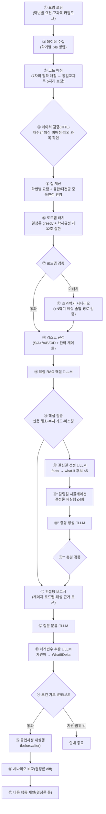

# KMU 졸업사정 컨설팅 에이전트 (졸업센터)

> repo: `chaeyeonkim0204/kmu-campus-life-action-agent`
> 국민대학교 학생의 **졸업 요건을 분석해 컨설팅 보고서**를 내주는 grounded 에이전트.
> ON국민 수강내역(.xls) × 학번별 요람 × 학사규정으로 **① 졸업 진단 ② 다전공 중복인정 ③ 학기별 로드맵(불가 시 초과학기 시나리오) ④ 요람 인용 달린 규정 해설 ⑤ 자연어 후속 질문 시뮬레이션(졸업 시나리오 상담 Agent)** 까지 제공한다.

---

## 1. 왜 상용 LLM이 아니라 이 서비스인가

| 차별점 | 설명 |
| --- | --- |
| 공식 요람·규정 grounding | 학번별 요람(연도별 요건·교과목 카탈로그)과 학사규정(제32조 학점상한·제77조 중복인정 등)을 근거로 답한다 — 환각 차단 |
| 개인 데이터 기반 | 상용 LLM이 볼 수 없는 **본인 수강내역**을 입력으로 진단·로드맵을 계산한다 |
| 결정론 보고서 | 판정·계산·로드맵·비교는 전부 결정론 코드 — **같은 입력 = 같은 결과** |
| 제한적 LLM + 검증 | LLM은 4곳(규정 해설 RAG·상담 질문 해석·갈림길 선정·비교 총평)만 쓰고, 산출물은 모두 결정론 validator가 재검증한다. **졸업 판정은 어느 LLM도 하지 않는다** |

## 2. 워크플로우

업무를 discrete node로 분절한 **결정론 워크플로우 + 제한적 LLM 4노드**. 각 노드 실행은 구조화된 trace로 방출되고, 프론트가 이 trace로 노드 그래프를 그린다(보고서 화면에서 노드가 순서대로 점등, 학생마다 다른 분기 경로가 켜진다).



> ⑪ 컨설팅 보고서는 trace 이벤트가 아니라 프론트가 합성하는 종착 노드(화면 표기 "리포트")이며, ⑫ 질문 분류·⑬ 매개변수 추출은 그래프상 2노드지만 **LLM 호출은 1회**(strict schema 단일 호출)다.

**LLM 호출 지점은 정확히 네 자리** — 전부 판정 금지:

| 자리 | 역할 | 패턴 |
| --- | --- | --- |
| ⑨ 규정 근거 해설 (`explain.py`) | 부족 항목 자동 선정 → 요람 Chroma 검색 → 인용 강제 해설 → validator → 캐시 | 보고서 내장 RAG |
| ⑫~⑬ 질문 분류·매개변수 추출 (`whatif.py`) | 자연어 질문("다음 학기 휴학하면?") → 시뮬레이션 파라미터(strict JSON schema) | Tool Calling 1회 |
| ⑪′·⑪‴ 에이전트 총평 (`report_summary.py`) | LLM이 what-if 갈림길 후보·delta 값을 골라 결정론 시뮬레이터로 검증 후 문장별 fact id 총평 | **단일 턴 bounded ReAct** — 1사이클 Thought→Action→Observation→Answer (LLM 호출은 선정·총평 2회, 멀티스텝 루프 없음) |

멀티스텝 ReAct 루프는 출력 일관성을 위해 **의도적으로 도입하지 않았다**. OpenAI 키가 없어도 진단·로드맵·G 근거까지는 완전 동작한다(해설·상담만 degrade).

## 3. 사용자 흐름

1. **학생정보 입력** — 입학연도(적용 요람 결정)·제1전공·다전공/부전공·잔여 학기·계절 허용 여부 등
2. **.xls 업로드** — ON국민 수강내역, 학기당 1파일, 여러 개 한 번에
3. **검증 테이블(HITL)** — 재수강 의심 팝업, 행별 포함/제외 토글, 이수구분 직접 편집 → 확정
4. **졸업사정 실행** — 종합 판정 배지 → 영역 게이지 → 융합전공 블록 → 미이수 필수 → 로드맵 타임라인(또는 초과학기 카드) → 📖 규정 근거 해설 → 에이전트 총평 → 근거 토글
5. **워크플로우 그래프** — 보고서 옆에서 노드가 순서대로 점등
6. **🔮 졸업 시나리오 상담** — 칩(휴학/계절/부전공 빼면/15학점) 또는 자유 질문 → before/after diff 카드 + 다음 행동 체크리스트

## 4. 실행 방법

### 요구 사항

- Python 3.11 (개발 환경은 conda `kmu-agent`)
- Node.js (프론트엔드 dev/build 시)
- OpenAI API 키 (선택 — 없으면 LLM 해설·상담만 비활성, 결정론 진단·로드맵은 동작)

### 백엔드 (FastAPI)

```bash
git clone https://github.com/chaeyeonkim0204/kmu-campus-life-action-agent.git
cd kmu-campus-life-action-agent

pip install -r requirements.txt

# LLM 기능(해설·상담·총평)을 쓰려면 .env 작성
cp .env.example .env   # OPENAI_API_KEY=... 입력

uvicorn app:app --reload --port 8001
```

- 프론트 dev 빌드는 API 주소를 `http://127.0.0.1:8001`로 하드코딩하므로 **개발 시에는 반드시 `--port 8001`** 로 실행한다.
- `frontend/dist`가 빌드돼 있으면 FastAPI가 `/`에서 직접 서빙한다(이 경우 `window.location.origin`을 쓰므로 포트 무관 — 기본 8000도 가능).
- 코드 수정 후에는 서버를 재기동할 것(WSL2에서 `--reload` 좀비 워커가 옛 코드를 서빙하는 사례 있음 — 포트 점유 프로세스를 kill).

### 프론트엔드 (Vite + React)

```bash
cd frontend
npm install
npm run dev      # http://127.0.0.1:5173 (백엔드 8001 필요)
npm run build    # frontend/dist 생성 → FastAPI가 / 에서 서빙
```

### 외부 공개 — Cloudflare Tunnel (데모 공유용)

로컬 서버를 임시 공개 URL로 노출하려면 [cloudflared](https://developers.cloudflare.com/cloudflare-one/connections/connect-networks/downloads/)를 사용한다(quick tunnel은 계정·도메인 불필요).

```bash
# 설치 (Linux/WSL2)
curl -L -o ~/.local/bin/cloudflared \
  https://github.com/cloudflare/cloudflared/releases/latest/download/cloudflared-linux-amd64
chmod +x ~/.local/bin/cloudflared

# 1) 프론트를 반드시 빌드 (중요 — 아래 주의 참고)
cd frontend && npm run build && cd ..

# 2) FastAPI 실행 (dist를 / 에서 서빙)
uvicorn app:app --port 8001

# 3) 터널 열기 → https://<랜덤>.trycloudflare.com URL이 출력됨
cloudflared tunnel --url http://127.0.0.1:8001
```

⚠️ **주의**

- **`npm run dev`(5173)를 터널로 열면 안 된다** — dev 빌드는 API 주소를 `http://127.0.0.1:8001`로 하드코딩하므로 외부 접속자의 API 호출이 전부 실패한다. 빌드된 `frontend/dist`를 FastAPI가 서빙하는 상태에서는 `window.location.origin`을 쓰므로 터널 도메인에서도 정상 동작한다.
- quick tunnel URL은 `cloudflared` 프로세스가 살아 있는 동안만 유효하며 재실행마다 바뀐다.
- 공개 URL은 누구나 접근 가능하다 — **본인 또는 더미 수강내역으로만 데모**하고, 시연이 끝나면 터널을 내릴 것(가드레일 §7 참고).

### 테스트

```bash
pytest                                  # 전체 (129 collected · 120 passed + live-LLM opt-in skip)
pytest tests/test_graduation_center.py  # 졸업센터 회귀
pytest tests/test_v2_pipeline.py        # v2 파이프라인
```

### 데모 자산

합성 학생 4명(`data/graduation/v2/demo_students/`) — 여유 통과(A+)·계절 필요(B)·초과 1학기(C)·최악(D) 시나리오를 커버한다. 재생성:

```bash
PYTHONPATH=. python scripts/make_demo_students.py
python scripts/warm_whatif_cache.py     # 상담 칩 질문 캐시 워밍업(오프라인 데모용)
```

## 5. API

### 메인 — v2 (엑셀 기반, 데모 경로)

| Method | Path | 목적 |
| --- | --- | --- |
| `GET` | `/graduation/v2/status` | v2 준비 상태 |
| `POST` | `/graduation/v2/verify` | 수강내역 .xls 업로드 → HITL 검증 테이블 |
| `POST` | `/graduation/v2/audit` | 결정론 졸업사정·로드맵·리스크 + RAG 해설 + 에이전트 총평 |
| `POST` | `/graduation/v2/whatif` | 졸업 시나리오 상담(자연어 what-if 시뮬레이션) |

### v1 (PDF 성적증명서 기반 — 유지되나 데모 비대상)

| Method | Path | 목적 |
| --- | --- | --- |
| `GET` | `/graduation/status` | 졸업센터 준비 상태 |
| `POST` | `/graduation/transcript/parse` | PDF 성적증명서 parse |
| `POST` | `/graduation/audit` | 졸업요건 분석 |
| `POST` | `/graduation/substitute-courses` 외 6종 | 대체과목·마이크로디그리·졸업후 체크리스트·직무역량 번역·조기졸업·자기설계전공·학점포기 (audit 포함 총 8개 분석 task) |

### 공통

| Method | Path | 목적 |
| --- | --- | --- |
| `GET` | `/health` | 서비스 상태 |
| `GET` | `/` | 프론트(빌드 시 `frontend/dist` 서빙) |

## 6. 프로젝트 구조

```
app.py                       FastAPI 엔트리포인트 (/graduation/* 전용)
graduation_center/
  v2/                        메인 축 — 엑셀 기반 v2 파이프라인
    excel_parser.py          .xls 파싱(다중 학기 병합)
    catalog.py               카탈로그·연도별 요건 프로파일·제32조 상한
    verification.py          HITL 검증 테이블·재수강
    audit_v2.py              졸업사정·융합 중복인정 3-way·그룹최저
    planner.py               결정론 로드맵(greedy)·검증·초과학기
    risk.py                  S~D 리스크 사다리·완화 게이트
    explain.py               규정 근거 해설(RAG+validator+캐시)   🤖 LLM ①
    whatif.py                졸업 시나리오 상담 Agent              🤖 LLM ②
    report_summary.py        에이전트 총평(단일 턴 bounded ReAct)  🤖 LLM ③·④
    pipeline.py              오케스트레이션·G citation·node_trace
  (v1: parser.py·service.py 등 — PDF 기반 8 task)
frontend/src/components/
  GraduationV2.jsx           컨설팅 대시보드(폼·검증·보고서·상담)
  WorkflowGraph.jsx          분기 갈래 워크플로우 그래프
data/graduation/v2/          카탈로그·연도별 요건·demo_students/·캐시
scripts/                     데모 학생 생성기·상담 캐시 워밍업
tests/                       pytest 스위트(졸업센터 회귀 + v2)
docs/graduation_center_current_state.md   현행 구조의 단일 진실(상세)
unused/                      옛 캠퍼스라이프 /ask 파이프라인 보관(복구: unused/README.md)
```

## 7. 가드레일

- **프라이버시**: 입력은 본인 수강내역(주민번호 없음). 학번 원본은 전송하지 않고(입학연도 4자리만), 출력에서 **학번 뒷자리를 마스킹**한다. 업로드 데이터는 비영속. 데모·공유는 본인 또는 더미 데이터로 할 것.
- **근거 우선 + graceful degrade**: 공식 근거(요람·규정)가 있으면 인용을 달아 답하고, 근거가 얇으면 차단하지 않되 `※ 요람 원문에서 직접 확인되지 않음 — 학과사무실 확인 권장`으로 확신도를 표시한다.
- **LLM 산출물 전수 검증**: 해설은 인용 해소·새 수치 가드·마스킹을 validator가 검사하고, 상담 추출 결과는 결정론 조건 가드(제32조 상한·환각 융합변경 제거)가 재검증한다.
- **최종 판정 아님**: 본 서비스는 컨설팅 도구이며 최종 졸업 사정은 학과사무실/교무팀 권한이다.

## 8. 알려진 한계 (프로토타입 범위)

- 연도별 요람: AI빅데이터융합경영(2022~2025)·미래모빌리티(2023·2025) — 다른 학과는 JSON 추가로 확장
- 융합전공 카탈로그는 데모 범위 2종(데이터사이언스·모빌리티데이터)
- 상담 Agent 지원 범위는 휴학·잔여 학기·계절학기·학점 상한·다전공/부전공 변경 5종(그 외 안내 종료), 멀티턴 없음
- 캐시 밖의 새 입력은 해설·상담에 LLM 1회 호출(5~11초)

## 9. 문서

| 문서 | 역할 |
| --- | --- |
| `docs/graduation_center_current_state.md` | **현행 구조의 단일 진실** — 워크플로우·검증 캠페인·데모 자산 상세 |
| `docs/demo_script_2026-06-09.md` | 발표 데모 진행 스크립트 |
| `docs/plans/whatif_consult_agent_plan.md` | 상담 Agent 설계·검증 대장 |
| `CLAUDE.md` | 개발 가이드(평가 기준·가드레일) |
| `unused/README.md` | 옛 `/ask` 파이프라인 복구 절차 |
