# Dify식 워크플로우 표현 — 발표 슬라이드용

> 실제 화면의 워크플로우 그래프(BASE 16노드 + 상담 클러스터 7노드)를 Dify 노드 어휘(시작/코드/
> 지식검색/LLM/IF·ELSE/반복/답변)로 1:1 번역한 것. 교수가 선호하는 Dify식 분기 그래프 표기 —
> 차이는 어휘뿐, 토폴로지는 데모 화면과 동일하다. (mermaid는 Notion·GitHub·VSCode에서 렌더링)

```mermaid
flowchart TD
    %% ═══════ 워크플로우 1: 검증 (HITL 경계까지) ═══════
    START(["▶ 시작<br/>수강내역 .xls 업로드 + 학생정보 폼<br/>(입학연도·전공·다전공·잔여학기)"])
    START --> N1["⚙ 코드: 요람 로딩<br/>학번별 요건·교과과정표"]
    N1 --> N2["⚙ 코드: 데이터 수집<br/>학기별 엑셀 병합 파싱"]
    N2 --> N3["⚙ 코드: 코드 매칭<br/>7자리 정확 → 5자리 보정 → 이름(+prefix 가드)"]
    N3 --> HITL{"✋ 사용자 확인 (HITL)<br/>재수강 팝업 · 포함/제외 · 이수구분 편집"}

    %% ═══════ 워크플로우 2: 졸업사정 본체 ═══════
    HITL -->|확정| N4["⚙ 코드: 갭 계산<br/>학번별 요람 + 중복인정 캡(제77조)"]
    N4 --> N5["⚙ 코드: 로드맵 배치<br/>결정론 greedy + 제32조 상한"]
    N5 --> IF1{"⑂ IF/ELSE: 로드맵 검증"}
    IF1 -->|통과| N6["⚙ 코드: 리스크 산정<br/>A~D 트리거 + 완화 게이트"]
    IF1 -->|미배치| OV["⚙ 코드: 초과학기 시나리오<br/>+N학기 재배치 검증"] --> N6

    %% LLM 자리 ① — RAG
    N6 --> KR["📚 지식 검색<br/>요람 Chroma 1,056 chunks"]
    KR --> L1["✦ LLM ①: 규정 해설 생성<br/>(chunk만 근거 · 판정 금지)"]
    L1 --> IF2{"⑂ IF/ELSE: 해설 검증<br/>인용 해소·수치 가드"}
    IF2 -->|위반 줄| MARK["⚙ 코드: '출처 미확인' 표시"] --> AGG
    IF2 -->|통과| AGG["⚙ 코드: 보고서 조립<br/>(변수 집계 — 결정론이 source of truth)"]

    %% ═══════ 에이전트 총평 — 단일 턴 ReAct ═══════
    AGG --> L2["✦ LLM ②: 갈림길 선정 ⟨Thought⟩<br/>facts → what-if 후보 ≤5 + delta 값 선택"]
    L2 --> IF3{"⑂ IF/ELSE: pre 필터<br/>전제 불일치 → 탈락 기록"}
    IF3 -->|통과 ≤4| ITER["🔁 반복(Iteration) ⟨Action·Observation⟩<br/>시나리오별: 결정론 재실행 → diff 관찰<br/>→ post 판정(효과 없음도 기록)"]
    IF3 -.->|탈락| LEDGER["📋 검토 원장<br/>(candidates_review — 사유 보존)"]
    ITER -.->|탈락| LEDGER
    ITER -->|채택 ≤3| L3["✦ LLM ③: 비교 총평 ⟨Answer⟩<br/>문장마다 fact id 인용"]
    L3 --> IF4{"⑂ IF/ELSE: 총평 검증<br/>수치·등급·판정단정·마스킹"}
    IF4 -->|위반 줄 폐기| L3
    IF4 -->|통과| END(["✅ 답변: 컨설팅 리포트<br/>판정·게이지·로드맵·해설·총평·근거 토글"])

    %% ═══════ 워크플로우 3: 상담 Agent (후속 질문) ═══════
    END --> Q(["▶ 시작: 자연어 질문<br/>'다음 학기 휴학하면?'"])
    Q --> L4["✦ LLM ④: 매개변수 추출<br/>질문 → WhatIfDelta (strict schema)"]
    L4 --> IF5{"⑂ IF/ELSE: 조건 가드<br/>제32조 상한·환각 융합변경 제거"}
    IF5 -->|지원 범위 밖| FAIL["💬 답변: 안내 종료<br/>(지원 범위·한도 안내)"]
    IF5 -->|통과| N7["⚙ 코드: 졸업사정 재실행<br/>before/after 결정론 2회"]
    N7 --> N8["⚙ 코드: 시나리오 비교 diff"] --> N9["💬 답변: diff 카드 + 다음 행동"]

    style L1 fill:#2563EB,color:#fff
    style L2 fill:#2563EB,color:#fff
    style L3 fill:#2563EB,color:#fff
    style L4 fill:#2563EB,color:#fff
    style HITL fill:#F59E0B,color:#fff
    style IF1 fill:#7C3AED,color:#fff
    style IF2 fill:#7C3AED,color:#fff
    style IF3 fill:#7C3AED,color:#fff
    style IF4 fill:#7C3AED,color:#fff
    style IF5 fill:#7C3AED,color:#fff
```

## 우리 노드 ↔ Dify 노드 타입 대응표

| Dify 노드 타입 | 우리 구현 | 개수 |
|---|---|---|
| ▶ 시작 (Start) | 파일 업로드+폼 / 상담 질문 입력 | 2 |
| ⚙ 코드 (Code) | 파싱·매칭·갭·로드맵·리스크·재실행·diff — **판정 전부 여기** | 11 |
| ✋ 사용자 확인 | HITL 검증 테이블 (Dify에 없는 타입 — 우리 차별점 ①) | 1 |
| 📚 지식 검색 (Knowledge Retrieval) | 요람 Chroma RAG | 1 |
| ✦ LLM | ①해설 ②갈림길 선정 ③총평 ④추출기 — **판정 0** | **4** |
| ⑂ IF/ELSE | 로드맵 검증·해설 검증·pre 필터·총평 검증·조건 가드 (LLM 출력 뒤 검증 — 차별점 ②) | 5 |
| 🔁 반복 (Iteration) | 시나리오 ≤4 시뮬레이션 루프 | 1 |
| 💬 답변 (Answer) | 리포트 / diff 카드 / 안내 종료 | 3 |

## 발표 내러티브 (한 단락)

> "Dify로 치면 **코드 노드 11개가 판정을, LLM 노드 4개가 비정형 처리만** 하는 워크플로우입니다.
> 특히 가운데 클러스터가 단일 턴 ReAct — LLM이 갈림길을 **선정**(Thought)하면 **반복 노드**가
> 결정론 시뮬레이터를 돌리고(Action·Observation), 탈락까지 기록한 관찰값으로 LLM이
> **총평**(Answer)을 씁니다. Dify와 다른 점은 두 가지 — 사람이 데이터를 확정하는 **HITL 노드**,
> 그리고 모든 LLM 출력 뒤에 붙는 **검증 IF/ELSE**입니다."

## 주의 (발표 금지 표현 — 교수 사인오프 기준)

- ❌ "LLM이 졸업 가능 여부를 판단합니다" → ✅ "판정은 결정론 엔진, LLM은 facts 안에서 비교할 갈림길을 선택"
- ❌ "완전한 자율 에이전트" → ✅ "보고서 총평 구간에 한해 **단일 턴 bounded ReAct**"
- 워크플로우 archetype 2개 프레임: **판정형(RAG 졸업사정)** vs **시뮬레이션형(what-if 상담·총평)** — 교수 피드백 "workflow 독특한 거 다른 거 하나"에 대한 답.
