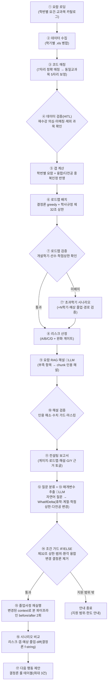

# 졸업센터 v2 — 구현 현황 (팀 공유용)

> **한 줄 요약**: ON국민 수강내역 .xls × 학번별 요람 × 학사규정으로 **① 졸업 진단 ② 다전공 중복인정 ③ 학기별 로드맵(불가 시 초과학기 시나리오) ④ 요람 인용 달린 규정 해설 ⑤ 자연어 후속 질문 시뮬레이션(졸업 시나리오 상담 Agent)**까지 내놓는 **결정론 졸업사정 컨설팅 에이전트** — 완성, 데모 가능 상태.
>
> 상태: **구현 완료 · 검증 수렴(상담 Agent 포함) · 데모 리허설 단계** · 갱신 2026-06-04 (발표 D-5)
> 기획 문서: [`graduation_center_direction.md`](./graduation_center_direction.md) · 기획 대비 변경 사유: [`graduation_center_direction_vs_built.md`](./graduation_center_direction_vs_built.md) · 데모 진행: [`demo_script_2026-06-09.md`](./demo_script_2026-06-09.md) · 상담 Agent 설계·검증 대장: [`plans/whatif_consult_agent_plan.md`](./plans/whatif_consult_agent_plan.md)

---

## 1. 지금 무엇이 있나 (완성된 것)

| 축 | 구현 | 상태 |
|---|---|---|
| 입력 | ON국민 .xls 다중 업로드(학기당 1파일) → 교과목코드 7자리 매칭(동일교과목은 앞 5자리) | ✅ |
| HITL 검증 | 재수강 의심 팝업(최신만 인정)·폐강 자동제외·요람 밖 과목은 집계만(환각 금지) | ✅ |
| 졸업사정 | **학번별 요람**(연도별 영역최저·필수과목·**choose-1 필수 그룹**, nearest-prior 폴백) + 핵심교양 영역별 | ✅ |
| 다전공/부전공 | 중복인정 캡(다전공 12/부전공 6, 제77조)·한도 초과 겹침의 **과목별 3-way 배정**(중복인정/제1전공/융합)·그룹별 최저·전공필수 융합이동 금지 | ✅ |
| 로드맵 | **결정론 greedy 통합 플래너** — 우선순위·선수·Ⅰ/Ⅱ 시퀀스·개설학기·학점상한(제32조: 130→18/136→19, 계절 6, 직전 3.75↑ +3) 준수 배치 + 결정론 검증 | ✅ |
| 실패 처리 | blocked여도 부분 배치 표시 + **초과학기 시나리오**(N학기·예상 졸업학기, 잔여+1 재배치로 경로 검증) | ✅ |
| 리스크 | A/B/C/D 결정론 트리거 + 완화 게이트 + **교양 50학점 상한(제7조⑧)·졸업인증제(심화+18 또는 다부전공) 경고** | ✅ |
| 근거 | **G1~G5** 결정론 citation(적용 요람 페이지·제32/77조·교양과정) + 근거 토글 | ✅ |
| **LLM 자리 ①** | **규정 근거 해설** — 보고서 내장 RAG(챗 UI 없음): 부족 항목 자동 선정 → 요람 Chroma(1056 chunks) 검색 → LLM 해설(source_ids enum 강제) → **validator**(인용 해소·새 수치 가드·마스킹, 미확인 줄 표시) → 캐시(동일 입력=동일 해설·지연 0) | ✅ |
| **LLM 자리 ② / 상담 Agent** | **졸업 시나리오 상담(what-if)** — 자연어 후속 질문("다음 학기 휴학하면?", "부전공 빼면?")을 **LLM 1회로 시뮬레이션 파라미터(delta)로 변환**(매개변수 추출기, 강의 예제06 Tool Calling 패턴) → IF/ELSE 조건 가드(제32조 상한·환각 융합변경 결정론 제거) → **기존 결정론 파이프라인 재실행(before/after)** → diff 카드(리스크·예상 졸업·갭)·다음 행동 제안. `POST /graduation/v2/whatif`, 캐시로 칩 질문 오프라인 동작 | ✅ |
| 시각화 | **워크플로우 그래프** — 12노드 + **상담 클러스터 7노드(상담 실행 시에만 동적 표시)**·조건 엣지 라벨·**분기 갈래**(통과 vs 미배치→초과학기 / 조건 가드 vs 안내 종료), 보고서 화면 인라인 + #workflow 확대 | ✅ |
| 프라이버시 | 학번 원본 미전송(입학연도 4자리만)·출력 학번 마스킹·비영속·상담 프롬프트에 학번/과목 목록 비포함 | ✅ |

---

## 2. 큰 그림 — 실제 워크플로우 (화면의 그래프와 동일)



- **LLM은 ⑨·⑫~⑬ 두 곳뿐, 역할이 정반대** — ⑨는 검색된 요람 chunk로 *근거를 생성*(RAG), ⑫~⑬은 자연어를 *안전한 도구 파라미터로 변환*(Tool Calling, 단일 strict-schema 호출의 두 출력). **졸업 판정은 둘 다 하지 않음** — 판정·계산·로드맵·비교는 전부 결정론 노드 (같은 입력 = 같은 결과, 3회 해시 동일 검증).
- ⑦의 갈래가 그래프 토폴로지로 갈라져 학생마다 **다른 경로가 점등**됨 (feasible 학생은 ⑦′가 점선으로 남음). ⑭의 갈래(통과 vs 안내 종료)도 동일 — 지원 범위 밖 질문은 실패 분기가 점등(예제06 실패메시지 패턴).
- 상담 클러스터(⑫~⑰)는 **상담 실행 시에만 그래프에 나타남** — audit만 한 화면은 기존 12노드 그대로. `after`의 내부 trace는 그래프에 합성하지 않음(본 보고서 노드와 이름 충돌 방지 계약).

---

## 3. 사용자가 겪는 흐름

1. **학생정보 입력** — 입학연도(적용 요람 결정)·제1전공·다전공/부전공 검색·현재/잔여 학기·계절 허용·직전학기 3.75↑·졸업 평점 충족 여부
2. **.xls 업로드** — 학기당 1파일, 여러 개 한 번에
3. **검증 테이블(HITL)** — 재수강 의심 팝업("최신만 인정할까요?"), 행별 포함/제외 토글 → 확정
4. **졸업사정 실행** — 1초 내(해설 캐시 시) 보고서:
   - 종합 판정 배지(A~D) → 영역 게이지 → 융합전공 블록(겹침·중복인정·3-way SEL·그룹) → 미이수 필수 → 로드맵 타임라인(or 부분배치+초과학기 카드) → **📖 규정 근거 해설**(요람 인용 Y 배지, 근거 약한 줄은 "※ 공식 출처 미확인") → 근거 토글(G/Y)
5. **워크플로우 그래프** — 보고서 옆에서 노드가 순서대로 점등, 분기 갈래 확인
6. **🔮 졸업 시나리오 상담** — 보고서 하단에서 칩(휴학/계절/부전공 빼면/15학점) 클릭 또는 자유 질문 입력 → before/after diff 카드(리스크 배지 전환·예상 졸업 변화·변경 후 로드맵 접기) + 다음 행동 체크리스트. 검증 테이블을 편집하면 "재실행 먼저" 가드로 입력 비활성(화면-시뮬레이션 불일치 방지)

---

## 4. 핵심 동작 원리

> **판정·계산 = 결정론(매번 동일) · 규정 해설 = LLM(인용 강제) · 질문 해석 = LLM(strict schema 강제) · LLM 산출물은 모두 결정론이 다시 검증.**

- **결정론 본체**: 매칭→사정→배치→리스크 전부 코드. OpenAI 키 없이도 진단·로드맵·G 근거까지 완전 동작.
- **LLM ① 해설(gpt-5-mini)**: 부족 항목 2~3개에 대해 검색된 요람 chunk **만** 근거로 해설 생성. 졸업 가능/불가 판정 금지(프롬프트+검증).
- **해설 validator**: 인용 id가 실제 chunk에 해소되는지, 숫자가 chunk 원문에 있는지(진단 숫자는 진단 참조 줄에만), 학번 마스킹 — 위반 줄은 "※ 공식 출처 미확인 — 학과사무실 확인 권장" 표시. **환각이 화면에 근거인 척 못 나옴.**
- **LLM ② 매개변수 추출기(상담)**: 질문 → `{category, delta}` strict json_schema(전 필드 required+nullable, 융합전공 id는 enum 동적·빈 enum 금지). **조건 가드**가 결정론으로 재검증: 법정 상한 초과는 규정 인용으로 거부, 질문에 없는 융합 변경(LLM 환각 — 리허설 실측 6건)은 **semantic guard가 제거 후 카드에 "환각 가드" 가정 명시**, 적용은 `model_validate` 재검증 통과 시에만. **판정은 LLM이 아니라 기존 파이프라인 재실행이 함.**
- **캐시**: 해설=(모델+항목+학과+입학연도), 상담=(질문+컨텍스트+융합 선언+schema 버전) 해시 키 — 데모 학생·칩 질문은 사전 warm-up(`scripts/warm_whatif_cache.py`, 환각 자동 검수·evict 포함)되어 지연 0·완전 오프라인 동작·동일 출력. 오염 캐시는 검증 실패 시 자동 evict 후 LLM 재해석(영구 고착 방지).

---

## 5. 데모 자산 — 합성 학생 4명 (`data/graduation/v2/demo_students/`)

전원 **AI빅데이터융합경영 제1전공 + 데이터사이언스융합전공 다전공**. 실제 카탈로그 기반·학년/개설학기 순 배치·학기당 상한 준수(넘침은 하계/동계 파일)·실명 같은 교양 과목명.

| 학생 | 파일 | 이야기 | 검증된 결과 |
|---|---|---|---|
| **S1 김융합** (졸업반 2022학번, 잔여1) | 9개 | **겹침 27 > 중복인정 캡 12** — 초과 15학점의 3-way 트레이드오프(결과 융합 9학점 부족) | 총 136/130 ✅ 미이수 필수 0 · 융합 27/36 ⚠️ · blocked 부분배치 · 초과 약 +1 → 2027-1 · C |
| **S2 박분석** (3학년 2022학번, 잔여3) | 5개 | **B그룹 0/12 공백** + 고학년 필수 3과목(회귀·머신러닝·딥러닝) 미이수 — 로드맵이 채움, 재수강 팝업(경영통계) | A 12/12 ✅ B 0/12 ⚠️ · 초과 +1 경로검증 → **C 완화** |
| **S3 이지연** (2학년 2024학번, 잔여2) | 3개 | 최악 케이스 — 필수 8건 미이수(**택1 그룹 라벨** 포함) | **D** · 초과 +4 · 미확인 줄 표시(validator 장면) |
| **S4 최계절** (4학년 2022학번, 잔여2) | 7개 | **데모 메인** — 막학기 딥러닝 1과목+융합 잔여 마무리, **적용 요람 2022가 화면 표시** | 총 108/130 · **feasible** 2학기 배치 · C 완화 · 그래프 전부 초록 직행 |

재생성: `PYTHONPATH=. python scripts/make_demo_students.py` · 입력값은 `manifest.json`/README 표 그대로.
실데이터(미래모빌리티 2023 + 모빌리티데이터 다전공)도 동작: 전공 64/62·핵심 18/17·융합 39/36·feasible·B — **학번별 요람(2023) 실적용 증거**.

---

## 6. 품질 — 어떻게 믿나

- **학사규정 부합 감사**(서브 3+codex 3): 제32조·제77조·제74조⑤ 등 조문 단위 대조 — 불일치 2건(캡 15분기·교양 50 상한) 수정, 범위외 규정(논문·등록학기 등)은 보고서 caveat로 명시.
- **검증 캠페인(본체)**: 적대적 리뷰 5라운드 → 수렴 루프 7라운드(라운드당 서브에이전트 3+codex 3, CRITICAL 0까지) → 교수 페르소나 평가 6인 → 신규코드 라운드 → 데모 시나리오 라운드(변주 3종 포함). 누적 발견·수정 ≈ 25건(슬롯 시퀀스 오인 대량미배치, credits 오염 OOM, 표면 모순 계열, 캐시 trace 거짓 '통과' 등).
- **검증 캠페인(상담 Agent)**: 계획 3라운드(발견 37건 반영 후 착수) + 코드 4라운드(라운드당 적대 서브 3+codex, **실서버 e2e·데모 리허설 라운드 포함**) → 발견 ~40건 중 수정 30+, 거짓양성 5 기각, HIGH 0으로 수렴. 하이라이트: 리허설에서 LLM 환각(질문에 없는 융합 포기) 실증 → 결정론 가드 도입 → 재워밍업 환각 0건 라이브 검증. 상세 대장: `plans/whatif_consult_agent_plan.md` §7.
- **테스트**: **236 passed** (파이프라인·사정·해설 validator·상담 35종·API), 결정론 3회 해시 동일.
- **장애 내성**: OpenAI/Chroma 다운 → 해설·상담만 degrade(본체 무영향, 상담은 캐시된 칩 질문 정상 동작·500 금지 계약), 손상 엑셀 422, 오염 입력 400, 완전 오프라인 데모 가능(캐시).

## 7. 알려진 한계 (정직하게)

- 연도별 요람: 미래모빌리티(2023·2025) + **ai_bigdata(2022~2025, 학과 공식 졸업요건 시트 기준 — 기초 최저 7·일선 58(글로벌영어 해지 일괄)·필수 11/12·택1 그룹(S-TEAM/사제동행, College EnglishⅠ·Ⅱ), 글로벌영어 필수 해지 일괄 반영)**. 다른 학과는 JSON 추가로 확장.
- 해설 일부 줄은 "공식 출처 미확인" 표시로 남음(전 섹션 인용률 S3 7/7 · S2 6/8 · S4 5/7) — 의도된 validator 동작이며 데모에선 "환각을 잡는 장면"으로 사용.
- 융합전공 카탈로그는 데모 범위 2종(데이터사이언스·모빌리티데이터)만.
- 캐시 키 밖의 새 입력은 해설 생성에 5~11초(LLM 1회). 상담도 미캐시 질문은 LLM 1회(칩 질문은 워밍업으로 캐시).
- **상담 Agent 한계(프로토타입 결정)**: 지원 범위는 휴학·잔여 학기·계절학기·학점 상한·다전공/부전공 변경 5종(그 외는 안내 종료) · 화면 3-way 배정(sel)은 서버 미반영이라 시뮬레이션은 기본 배정 기준(UI 캐비엣 표시) · 다전공 추가 후보의 학과별 신청 자격 필터 없음(다음 행동 캐비엣으로 안내) · 멀티턴 없음(질문 1회=시뮬레이션 1회) — ReAct 멀티스텝은 의도적으로 미구현(일관성 우선, 발표에서 "확장 방향"으로 언급).

## 8. 남은 일 (D-5)

1. **발표 슬라이드** — §2 그래프·vs ChatGPT 1장·아키텍처 1장 (데모 스크립트의 타임라인 참조)
2. 데모 리허설(스크립트대로 S4→S1, 상담 칩 비트 포함, 변주 대응 포함)
3. **발표 직전 상담 캐시 워밍업** — `/home/carol/exit/envs/kmu-agent/bin/python scripts/warm_whatif_cache.py` (✅ 환각 0 확인 후 종료) · **코드 수정 시 서버 무조건 재기동**(stale 프로세스 함정 — demo_script fallback 표 참조)
4. ~~ai_bigdata 연도별 요람~~ ✅ 완료(2022~2025, 학과 공식 시트) — 데모 학생 전원이 학번별 요람을 실제로 탐
5. ~~졸업 시나리오 상담 Agent~~ ✅ 완료(검증 4라운드 수렴) — "단순 계산기 아닌가" 질문에 대한 Tool Calling 답변

## 핵심 파일 맵

```
graduation_center/v2/
  excel_parser.py   .xls 파싱(다중 학기 병합)
  catalog.py        카탈로그·요건 프로파일(연도별)·제32조 상한
  verification.py   HITL 검증 테이블·재수강
  audit_v2.py       졸업사정·융합 중복인정 3-way·그룹최저
  planner.py        결정론 로드맵(greedy)·검증·초과학기
  risk.py           A~D 트리거·완화 게이트
  explain.py        규정 근거 해설(RAG+validator+캐시)  ← LLM 사용처 ①
  whatif.py         졸업 시나리오 상담 Agent(매개변수 추출기 ← LLM 사용처 ②,
                    조건 가드·semantic guard·결정론 diff·다음행동·캐시)
  pipeline.py       오케스트레이션·G citation·node_trace·skip_explain
frontend/src/components/
  GraduationV2.jsx  컨설팅 대시보드(폼·검증·보고서·해설·근거·🔮상담 카드)
  WorkflowGraph.jsx 분기 갈래 그래프(인라인+#workflow, 상담 클러스터 동적)
data/graduation/v2/  카탈로그·연도별 요건·demo_students/·explain_cache·whatif_cache
scripts/make_demo_students.py  데모 학생 생성기
scripts/warm_whatif_cache.py   상담 캐시 워밍업(환각 자동 검수·evict)
tests/test_v2_*.py   236 테스트 (상담 35종 포함)
```
