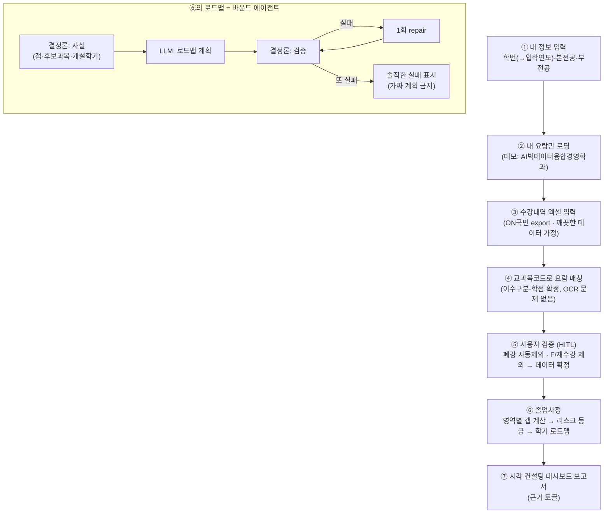

# 졸업센터 — 졸업사정 컨설팅 에이전트 (팀 공유용)

> **한 줄 요약**: 내 수강 데이터 + 내 학번·전공 요람으로 **① 졸업 가능한지 진단**하고 **② 남은 학기에 뭘 들어야 안전하게 졸업하는지**를 **컨설팅 보고서**로 알려주는 에이전트.
>
> 상태: **방향 확정 (LEAN)** · 작성 2026-06-02 (팀 + codex 4회 검토) · 코딩용 상세 스펙은 [`legacy/graduation_center_spec_en.md`](./legacy/graduation_center_spec_en.md)

---

## 1. 왜 만드나 / 뭐가 다른가

**학생 고충**: 졸업요건은 복잡하고, 입학연도마다 요람이 다르고, "나 지금 뭘 더 들어야 졸업하지?"가 막막하다.

### vs ChatGPT — 상용 LLM이 *못* 하는 것
| | ChatGPT | 우리 졸업센터 |
|---|---|---|
| 내 수강 데이터 | 모름 (일반론) | 내 실제 데이터로 |
| 학점 계산 | 숫자 환각 | **정확히 계산** |
| 내 학번 요람 | 모름 | **입학연도별 요람** 적용 |
| 요람 밖 과목 | 지어냄 | 손대지 않고 **사용자 확인** |
| 결과물 | 텍스트 | **컨설팅 대시보드** |

→ **차별점 = "정합성"(내 데이터·내 요람을 정확히 맞추는 것).** 이게 신뢰의 토대.

### vs 커리어 에이전트 (다른 팀 주제) — workflow가 달라야 함
| | 커리어 에이전트 | 졸업센터 |
|---|---|---|
| 데이터 | 외부 공지(비정형) | 개인 수강내역+요람(정형) |
| 사용자 개입 | **행동 승인** (실행 전) | **데이터 검증** (분석 전) |
| 끝점 | 외부 액션 실행(캘린더/노션) | 진단·로드맵 산출 |
| 성격 | **행동형**(executor) | **분석·플래너형**(analyst) |

→ 둘 다 "사용자 확인"이 있어도 **목적이 정반대**라 대비가 또렷.

---

## 2. 큰 그림 (워크플로우)



---

## 3. 사용자가 겪는 흐름 (쉽게)

1. **내 정보 입력** — "2024학번, AI빅데이터융합경영학과, 부전공 OO" → 졸업요건은 학번·전공마다 다르니까.
2. **내 요람만 꺼냄** — 졸업요건 책에서 *내 학번·내 전공* 부분만.
3. **수강내역 엑셀 업로드** — ON국민에서 받은 깨끗한 파일(데모는 미리 준비).
4. **요람이랑 대조** — 교과목코드로 정확히 맞춤. (성적증명서 OCR과 달리 오타 없음)
5. **"이거 맞아?" 확인** — 폐강은 자동 제외, F(불합격)·재수강 과목은 내가 체크(재수강은 통과한 최신 것만 인정) → 데이터 확정.
6. **졸업 진단** — 영역별 부족 학점 계산 → 위험도(안전/주의/위험) → **남은 학기에 뭘 들을지 로드맵**.
7. **컨설팅 보고서** — 한눈에 보는 대시보드, 근거는 펼쳐 볼 수 있음.

---

## 4. 무엇을 만들고 / 무엇을 뺄지 (LEAN)

| | 내용 |
|---|---|
| ✅ **주력 (이번에 만듦)** | 진단(졸업 가능?) · 영역별 갭 · **리스크 등급** · **단일 추천 학기 로드맵** · 시각 대시보드 보고서 |
| ⏳ **후순위 (여력 시)** | 다중 경로 비교(A·B·C 시나리오) · ON국민 다운로드 안내 가이드 · 제약 토글 재플랜 |
| 🚫 **안 만듦 (오버스코프)** | OCR 성적증명서 경로 · 엑셀 풀 에러처리 UX · F/재수강 자동판별 · 전 학과/전 연도 · 자유 도구선택 ReAct (단, 엑셀 컬럼 존재 여부 최소 체크는 함) |

**범위**: 한 학과(AI빅데이터융합경영학과) · 1~2개 입학연도 · 데모 happy path · *좁되 매끄럽게*.

---

## 5. 어떻게 동작하나 (핵심 원리)

> **계산은 컴퓨터가(정확하게) · 판단은 LLM이(나한테 맞게) · LLM 판단은 다시 컴퓨터가 검사.**

- **컴퓨터(결정론) = 사실 담당**: 학점 계산, 요람 조회, 과목 매칭, 부족분 산출, 리스크 등급, 검증. → 검증된 입력·요람 JSON에 대해 *재현 가능하게* 계산 (입력·JSON이 틀리면 결과도 틀리니 **데이터 정확성이 관건**).
- **LLM = 판단 담당**: 부족분을 보고 *어느 과목을 어느 학기에 들을지* 로드맵을 짠다 (선수과목·개설학기·부하·관심 고려). → 단순 계산이 아니라 *판단* = agentic.
- **컴퓨터 = 검사 담당**: LLM 로드맵이 진짜 가능한지(과목 실재·개설학기·선수순서·학점 충족) 재검사 → 틀리면 1회 다시 → 그래도 틀리면 **"이렇게는 안 됨, 이유는 X" 솔직히** (가짜 계획 절대 금지).

이래서 **"계산기"도 "ChatGPT"도 아닌** 자리 — LLM이 진짜 판단하되, 컴퓨터가 검사하니 거짓말을 못 함.

---

## 6. 결과물 — 컨설팅 보고서 (예시)

```
┌ 📋 졸업사정 컨설팅 리포트 ─────────────────────────────────────────────────────┐
│ AI빅데이터융합경영학과 · 2024학번 · 본전공 + 데이터과학 부전공                     │
│ ───────────────────────────────────────────────────────────────────────────── │
│ 종합 판정: 🟡 주의                                                               │
│   "정규 2학기로 졸업 가능. 전공선택 6학점만 보완하면 됩니다."                       │
│   졸업 예상: 2027-1 이수 후                                                       │
│ ───────────────────────────────────────────────────────────────────────────── │
│ ① 영역별 이수 현황                                                               │
│    총학점    ▓▓▓▓▓▓▓▓▓░  124 / 130   (6학점 부족)                               │
│    전공필수  ▓▓▓▓▓▓▓▓▓▓   18 / 18   ✅                                          │
│    전공선택  ▓▓▓▓▓▓▓▓░░   24 / 30   ⚠️ 6학점 부족                               │
│    교양(기초·핵심·자유)            모두 충족 ✅                                   │
│    데이터과학 부전공  ▓▓▓▓▓▓▓▓▓▓   21 / 21   ✅                                 │
│ ───────────────────────────────────────────────────────────────────────────── │
│ ② 핵심 이슈                                                                      │
│    • 전공선택 6학점 부족 (= 총 부족분 전부) [G2]                                   │
│    • 추천 과목 '데이터마이닝'은 2학기에만 개설 → 수강 시점 주의 [G3]               │
│ ───────────────────────────────────────────────────────────────────────────── │
│ ③ 추천 학기별 로드맵                                                             │
│    2026-2 │ 데이터마이닝 (전공선택 3학점)  … 2학기 개설                          │
│    2027-1 │ 머신러닝   (전공선택 3학점)  … 선수과목: 데이터마이닝                │
│    └ 합계 6학점 → 전공선택 부족분 정확히 충족                                     │
│    왜 이 계획: 머신러닝은 데이터마이닝이 선수과목이라 다음 학기에 배치,            │
│               데이터마이닝은 2학기만 개설되어 2026-2에 먼저 수강. [G2][G3]         │
│ ───────────────────────────────────────────────────────────────────────────── │
│ ④ 다음 단계                                                                      │
│    ☐ 데이터마이닝 2026-2 개설·수강신청 가능 여부 학과 확인                        │
│    ☐ 데이터과학 부전공 인정 학점 최종 확인                                        │
│ ───────────────────────────────────────────────────────────────────────────── │
│ ▸ 근거 보기 (요람 출처) [접힘]                                                   │
└─────────────────────────────────────────────────────────────────────────────────┘
```
> 숫자 일관성 체크(예시 자체 검증): 총 부족 6 = 전공선택 부족 6 = 로드맵 합계 6. 전공필수·교양은 모두 충족이라 로드맵엔 전공선택만. 선수과목(데이터마이닝→머신러닝) 때문에 두 학기로 분산.

**텍스트 덤프와 다른 점**: ① 결론(판정)을 맨 위에 ② 게이지·타임라인 시각화 ③ 개인화 ④ "왜 이 계획인지" 이유 ⑤ 바로 할 일 ⑥ 근거는 접어둠.

---

## 7. agentic 차별점 + 데모 킬러 장면

**한 줄 피치**: *"일반 졸업 조언 챗봇이 아니라, 내 정형 기록을 검증하고 정확한 학과 카탈로그와 대조해 리스크를 잡고 실현가능한 학기 로드맵을 수리(repair)해 근거 달린 컨설팅 대시보드를 내놓는 바운드 졸업사정 에이전트."*

**데모 킬러 장면 (여력 시 옵션)**: 조건을 토글한다 — *"남은 학기 2→3"* 또는 *"이번 학기 5과목 초과 금지"* → **로드맵이 즉석에서 다시 짜짐**. 근데 옆 패널엔 **모든 과목·요건이 요람 몇 페이지 근거인지** 표시. → "생각도 하고 + 근거도 있다" = ChatGPT랑 눈에 보이게 다름. (※ 같은 *단일 계획*을 바뀐 제약으로 재실행하는 것 — 여러 시나리오 비교가 아님(그건 후순위).)

---

## 8. 데이터 · 프로토타입 범위

- **1순위 작업 = 데이터 확보**: AI빅데이터융합경영학과 요람 →
  - `course_catalog.json` (과목코드·명·별칭·학점·이수구분·영역·근거 page)
  - `requirements.json` (입학연도·전공별 졸업요건 프로파일)
  - → **요람 풀파싱 하지 말고 손으로 검증한 JSON**이 더 빠르고 신뢰도↑. 이게 없으면 나머지가 다 겉치레.
- **입력 데이터**: 실제 ON국민 수강내역 엑셀과 *같은 형식*의 깨끗한 샘플. (컬럼: 이수구분·교과목코드·교과목명·학점·폐강여부·영역)
- **프라이버시(최소)**: 입력에 주민번호 없음 → **학번 뒷자리만 마스킹**, 내 성적·과목은 보여줌. 외부 유출·영속 저장 금지. 데모는 본인/더미 데이터.

---

## 9. 다음 할 일 (빌드 순서)

1. **데이터** — `course_catalog.json` + `requirements.json` (한 학과·1~2개 연도, 손 검증) ← 선행, 요람 자료 필요
2. **스키마** — 학생 컨텍스트·검증 데이터·진단 결과·로드맵·리스크 (스펙 문서 참고)
3. **엑셀 파싱 + 코드 매칭 + 검증 테이블**(HITL)
4. **결정론 진단 + 리스크** & **LLM 로드맵 플래너 + 검증기**
5. **시각 대시보드 보고서**

> 옛 코드(`graduation_center/`)에서 **걷어낼 것**: 과잉 마스킹(내 데이터 가림), 과잉 헷지("몰라요/확인 필요" 남발), Chroma 필수 의존. 자세한 건 코딩 스펙 문서.
