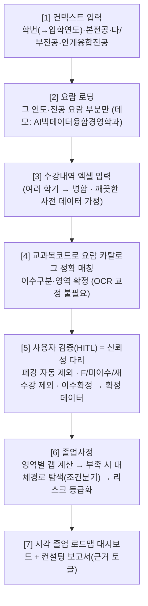

# 졸업센터 재설계 방향 (Direction)

> 작성 2026-06-02 · 메인 축(졸업센터) 방향 정리 · 팀 + codex 2차 검토 반영
> 관련: `CLAUDE.md`(전체 방향), `docs/second_topic_workflow_candidates.md`(두 번째 주제=커리어 에이전트)
> 상태: **방향 합의 완료. 이 문서가 졸업센터 구현 기준.** 코드 착수는 §10 빌드 순서대로.

---

## 1. 큰 틀 — "내 학번·내 전공에 정확히 맞춘 졸업사정 컨설턴트"

ChatGPT는 *일반론*("보통 전공 X학점 필요")만 말한다. 우리는 **당신의 입학연도 요람 × 당신의 전공 구성 × 검증된 당신의 수강 데이터**로 정확히 진단한다. → **정합성(데이터 정확성) 자체가 차별점.**

핵심: 가치는 "화려한 agentic"이 아니라 **"내 데이터·내 요람을 정확히 맞추는 정합성"**. 정합성을 확보하면, 과하게 "확인 필요"로 떠넘기던 답변을 **자신 있게 단정**할 근거가 생긴다.

---

## 2. 차별화 근거

### vs ChatGPT
ChatGPT는 ① 입학연도별 요람 차이를 모르고 ② 내 수강 데이터를 정확히 모르며 ③ 요람에 없는 과목을 환각으로 채운다. 우리는 셋 다 grounded로 막는다. ("ReAct"라는 알고리즘 라벨에 매이지 않는다 — 교수 진의는 *상용이 못 하는 차별화된 agentic*.)

### vs 커리어 에이전트 (두 번째 주제) — workflow가 달라야 한다
| | 커리어 에이전트 | 졸업센터 |
|---|---|---|
| 데이터 | 외부 공지(비정형) | 개인 수강내역+요람(정형) |
| 사용자 개입(HITL) | **행동 승인**(실행 전) | **데이터 검증**(분석 전) |
| 끝점 | 외부 액션 실행(캘린더/노션) | 정밀 진단·로드맵 산출 |
| 성격 | 행동형(executor) | 컨설팅·분석형(analyst) |

둘 다 HITL이 있어도 **목적이 정반대**(행동 게이트 vs 데이터 게이트)라 대비가 또렷하다.

---

## 3. 입력 & 데이터 (확정)

- **입력 = ON국민 '수강신청내역조회' 엑셀** (학기별 export). 컬럼: 순번·이수구분·교과목(코드)·교과목명·분반·학점·이론·실습·담당교수·강의시간·영역·폐강여부·수업계획서.
  - **쓰는 컬럼**: `이수구분`, `교과목코드`, `교과목명`, `학점` (+ `폐강여부` 필터, `영역` 교양 세부영역 매칭)
  - 정형 데이터라 **OCR/오타 교정 문제 자체가 사라짐** — 교과목코드로 요람 카탈로그 **정확 매칭**.
- **한계 = 성적(등급)이 없음**: 수강내역은 "신청"이지 "이수(통과)"가 아님 → F·재수강을 그냥 세면 학점이 부풀려짐. → **§4 [5] 검증 단계가 이 약점을 메우는 "신뢰성 다리"** 역할(폐강 자동 제외 + 사용자가 F/미이수/재수강 제외 → 확정 행만 사정).
- **데모는 깨끗한 사전 데이터**(실제 엑셀과 *같은 컬럼 모양*)를 가정. 가짜가 아니라 "진짜 파이프라인 + 깨끗한 진짜 형식 데이터".
- 자동 수집 안 함(ON국민 로그인 포털 — 가드레일). 사용자 수동 export가 유일 경로 → §9 참고.

---

## 4. 워크플로우 [1]~[7]



**[6] 내부 — 직선이 아니라 분기·수렴:** 갭 발견 시 여러 경로를 탐색·비교해 하나로 수렴(커리어의 선형 파이프라인과 대비).
```
영역별 갭 계산 → (부족)
   ├─ 필수 누락 → 대체과목 후보
   ├─ 영역 갭 ≤6 → 정규/계절학기 채움
   ├─ 전선 갭 → 마이크로디그리(해당 영역 충족 가능할 때만)
   └─ 조기졸업 → 거의 충족 + 등록학기/평점 조건 맞을 때만
        ↓ 수렴
   리스크 등급화 → 학기별 로드맵
```

---

## 5. task 구성 — audit 플래그십 + 나머지는 도구

기존 8개 task(audit·조기졸업·커스텀전공·성적포기·대체과목·마이크로디그리·졸업후체크리스트·직무역량번역)를 별도 단발 기능이 아니라:
- **audit(졸업사정)** = 메인 플래그십. [1]~[7] 전체 플로우.
- **나머지** = audit의 [6]에서 호출되는 **도구(대체경로 탐색기)** 로 재활용.

→ "8개 곁다리"가 "하나의 졸업사정 컨설팅"으로 통합.

---

## 6. 핵심 설계 원칙 (codex 검토 반영)

1. **GPT는 보조, 결정론이 진실.** GPT가 OCR 교정/도구 선택의 *중심 지능*이 되면 안 됨. 입력은 정형 엑셀 → **교과목코드 정확 매칭이 교정**. 매칭 캐스케이드: 코드 정확일치 → 정규화 한글명 → 별칭 → fuzzy(`rapidfuzz`) → 임베딩은 후보 랭킹만(단독 자동교정 금지). 카탈로그 밖 과목은 **원문 보존 + '확인 필요' 플래그**(GPT가 손대지 않음).
2. **대체경로 탐색 = 조건분기, LLM 컨트롤러 아님.** 경로가 적고 규칙 중심이라 데모 안정성↑. LLM은 보고서 *문장 다듬기*에만.
3. **리스크 등급 = 결정론적 + 사유 컴포넌트.** 교수가 공식을 보고 납득할 수 있게. 예: `A 안전`(갭≤3·필수 미달 없음) / `B 주의`(갭≤6·필수 ≤1) / `C 위험`(갭 7~15 또는 필수 2+ 또는 개설빈도 리스크) / `D 졸업불가 가능성`(갭>15·평점 미달·잔여학기 부족). 라벨만 주지 말고 `{grade, score, reasons:[{factor, detail, severity}]}`.
4. **JSON-first 응답.** 백엔드는 `{audit, risk, paths, roadmap, report_markdown, sources}` 구조화 데이터를 주고, 프론트가 대시보드로 그림.
5. **Chroma 없이도 동작.** 재설계 코어는 정형 JSON만으로 작동(벡터검색 선택). 현재 `status()`가 Chroma 필수로 막는 것 완화.

---

## 7. 보고서 / 대시보드 (Q3 = 시각 대시보드형)

JSON-first 데이터로 그리는 8섹션:
1. 컨텍스트 카드: 입학연도·본전공·다/부전공·적용 요람
2. **검증 테이블**: 원본 → 확정값, 편집 가능, 폐강/F/재수강 제외 토글
3. 영역별 학점 게이지: 총학점·전공필수·전공선택·기초교양·핵심교양·자유교양
4. 부족 요건 테이블: 부족 학점·누락 필수과목·근거 page
5. 대체경로 시나리오 카드: "정규학기" / "계절학기 포함" / "대체과목 신청" 비교
6. 리스크 배지(안전/주의/위험) + 사유
7. 학기별 로드맵 타임라인
8. 근거(citation): `G1/G2` 생성·검증 유지, **기본 접힘 + "근거 보기" 토글**

**값싼 데모 강화 요소**: assumptions 패널("이 데이터는 학생 검증 완료 기준"), 근거 토글, 시나리오 카드, 리스크 라벨, **노드 트레이스**(`요람 로딩 → 데이터 검증 → 갭 계산 → 대체경로 → 리스크 산정` — Dify식 시각화).

> 역할 분담이 졸업센터 vs 새 주제로 바뀌어, 졸업센터 담당이 분석+대시보드 **풀스택**을 가짐.

---

## 8. 기존 코드에서 걷어낼 옛 규율

현재 `graduation_center`는 옛 강한 규율(성적표=독성 PII 마스킹, 과잉 헷지)을 구현 중 → 새 방향과 충돌.

### (A) 과잉 마스킹 (내 데이터를 가려 검증·표시를 막음)
- `parser.py` `masked_name`/`masked_student_id`, `service.py` `SENSITIVE_PATTERNS`/`_sanitize_sensitive_output`, `status().privacy(returns_gpa_value:False 등)`, `_input_safety_flags` blocked 경로
- → **학번 뒷자리 정도만** 또는 거의 해제. 내 수강·학점·과목은 검증·대시보드에 표시.

### (B) 과잉 헷지 ("몰라요/확인 필요" 남발)
- `_analysis_prompt`의 "확정 말고 확인 필요로", `_build_answer`의 반사적 `[학과·교무팀 확인]`+`[최종 확인]` 꼬리표
- → **답변 원칙**: "근거 있으면 단정, 진짜 모를 때(학과 재량·요람 밖)만 확인 필요". 미지원 케이스는 모호한 "확인 필요" 말고 **`unsupported_for_demo`로 명시**.

### 유지할 최소 경계
- 외부 유출 금지(타인 전송·영속 저장 안 함) · 데모는 본인/더미 데이터

---

## 9. 데모 범위 (확정)

**빼는 것 (plumbing / 오버스코프):**
- ON국민 다운로드·업로드 **안내 가이드** → *나중에 여력 되면* 구현(TODO)
- 엑셀 형식 검증·친절한 에러 처리, OCR/성적증명서 경로
- F/재수강 **자동** 처리(사용자 수동 확인으로 대체), 전 학과/전 연도, 복잡한 경로 최적화

**지키는 것:**
- 입력 = 수강내역 엑셀 형식의 **깨끗한 사전 데이터**
- **검증 테이블 유지**(신뢰성 다리) · §6 설계 원칙 · §7 대시보드 · 차별점([2]요람매칭·[6]정확 갭)

**전제:** 미리 준비한 데이터로 시연하는 **워크스루형 데모**. 발표에서 실입력 경로는 *말로* 언급("실서비스는 ON국민 엑셀 업로드"). (발표 "스크립트 금지"는 말 대본 금지이지 데모 데이터 사전준비 금지가 아님.) 즉석 라이브 업로드 데모를 할 거면 그때 최소 안내 필요.

---

## 10. 빌드 순서 (codex 권장)

1. **v2 스키마**: `StudentContext`, `MajorConfiguration`, `CatalogCourse`, `CourseMatch`, `VerifiedTranscript`, `RequirementProfile`, `AuditResult`, `AlternativePath`, `RiskAssessment`
2. **데이터**: `course_catalog.json` + `requirements_v2.json` — AI빅데이터융합경영학과 + 1~2개 연도만. **요람 풀파싱 오버빌드 금지, 손으로 검증한 JSON**이 더 빠르고 신뢰도↑ (← 1순위 결손; 이게 없으면 나머지가 겉치레)
3. **엑셀 파싱 + 코드→카탈로그 매칭 + 검증 테이블**(HITL)을 사정 이전 단계로
4. **결정론적** `audit.py` / `risk.py` / `path_explorer.py`(조건분기)
5. 프론트를 여러 탭 → **하나의 가이드형 audit 워크플로우 + 대시보드**로

요건 데이터 스키마(예시):
```json
{ "profiles": [ {"profile_id":"2025_ai_bigdata_primary","admission_year":2025,
  "program_id":"ai_bigdata_convergence_management","track_type":"primary_major",
  "total_credits_min":130,"rules":[{"area":"전공필수","min_credits":18,"required_course_ids":["..."],"source":{"page":310}}]} ],
  "composition_rules":[{"when":{"primary_major":true,"minor":true},
  "effects":[{"target":"primary_major.min_credits","set":48},{"target":"minor.min_credits","set":21}]}] }
```

---

## 11. 남은 디벨롭 / TODO

- **데이터 확보(1순위)**: AI빅데이터융합경영학과 요람 → `course_catalog.json`(과목코드·명·별칭·학점·이수구분·영역·근거page) + `requirements_v2.json`(연도·전공별 프로파일). 손 검증.
- **검증 테이블 ↔ 백엔드 데이터 흐름** 확정(편집 결과 → `VerifiedTranscript`).
- 노드 트레이스 스키마(커리어 에이전트와 공유 여부).
- (나중) ON국민 다운로드 안내 가이드.
- (확보 필요) 깨끗한 데모용 수강내역 엑셀 샘플(실 형식).
