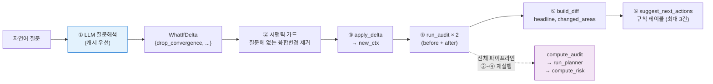

# 졸업요건 판단 파이프라인 — 상세 워크플로우

> 갱신: 2026-06-06 · 졸업인증제 사다리 캡 수정 반영
>
> 이 문서는 **모듈 내부 로직 단위**의 상세 분해도다. 화면 그래프와 동일한 **노드 단위 큰 그림**(16노드+상담 7노드)은 [`graduation_center_current_state.md`](./graduation_center_current_state.md) §2 참조 — 그쪽이 발표·팀 공유용 원본이고, 이 문서는 코드 수정 시 의사결정 분기를 추적하기 위한 개발용이다.

---

## 1. 전체 흐름 (mermaid)

```mermaid
flowchart TD
    subgraph VERIFY ["① run_verify  —  엑셀 파싱 + 과목 매칭"]
        V1["parse_many()<br/>학기별 .xls 병합"] --> V2["match_course()<br/>교과목코드 7자리 매칭"]
        V2 --> V3{"매칭 결과"}
        V3 -->|코드+이름 OK| V4["카탈로그 매칭<br/>→ requirement_area 배정"]
        V3 -->|코드 밖| V5["aggregate_only<br/>(집계만, 전공이면 일선 강등)"]
        V3 -->|미매칭| V6["unresolved<br/>(수동 확인 대상)"]
        V4 & V5 & V6 --> V7["재수강 탐지<br/>최신=포함, 이전=제외"]
        V7 --> V8["HITL 검증 테이블<br/>사용자: 포함/이수구분 수정"]
    end

    V8 --> FT["finalize_transcript()<br/>confirmed / excluded 분류<br/>earned_by_area 집계"]

    subgraph AUDIT ["② compute_audit  —  갭 계산 (결정론)"]
        A0["assemble_requirement_profile()<br/>학번별 요람 로딩"] --> A1

        A1["_convergence_checks()<br/>융합전공 사정 (제77조)"]
        A1 --> A1a["designated 과목 식별<br/>(교과목코드 앞5자리)"]
        A1a --> A1b["overlap 탐지<br/>(제1전공 ∩ 융합전공)"]
        A1b --> A1c["3-way 배정<br/>dup(중복인정, cap) / primary / fusion"]
        A1c --> A1d["group_checks<br/>그룹별 최저 (다전공12/부전공6)"]
        A1d --> A1e["to_fusion_total 산출"]

        A1e --> A2["major_effective<br/>= 전공이수 − to_fusion_total"]

        A2 --> A3["영역별 갭 (area_gaps)"]
        A3 --> A3a["전공: major_effective vs 전공최저"]
        A3 --> A3b["기초교양: earned vs 요건"]
        A3 --> A3c["핵심교양: earned vs Σ영역별최저"]
        A3 --> A3d["자유교양: earned vs 요건"]

        A3a & A3b & A3c & A3d --> A4["교양 50학점 상한 (제7조⑧)<br/>초과분 → 총학점 불인정"]
        A4 --> A5["total_gap = max(0, 졸업최저 − countable)"]
        A5 --> A6["필수과목 누락<br/>학번 요람 이름매칭 + 택1그룹"]
    end

    FT --> A0

    A6 --> PL

    subgraph PLANNER ["③ run_planner  —  로드맵 배치 (결정론 greedy)"]
        PL["후보 풀 조립 (우선순위)"]
        PL --> PL1["P1: 필수과목 (missing_required)"]
        PL --> PL2["P2: 융합 부족 (convergence gap)"]
        PL --> PL3["P3: 전공 부족 (major gap)"]
        PL --> PL4["P4: 교양 부족 (기초/핵심/자유)"]
        PL --> PL5["P5: 일반선택 (총학점 잔여)"]
        PL --> PL5a["P5: 심화전공 실과목<br/>(총학점gap 범위 내)"]
        PL --> PL6["P6: 심화전공 advisory ★<br/>(soft — feasible 미반영)"]

        PL1 & PL2 & PL3 & PL4 & PL5 & PL5a & PL6 --> GR

        GR["plan_greedy()<br/>우선순위·선수DAG·개설학기·cap"]
        GR --> GR1{"배치 결과"}
        GR1 -->|전부 배치| GR2["feasible = True"]
        GR1 -->|미배치 있음| GR3["overflow 산출<br/>shortfall / cap → extra학기"]
        GR1 -->|배치 불가| GR4["blocked"]
    end

    GR2 & GR3 & GR4 --> OV

    OV{"overflow ≤ 1학기?"}
    OV -->|Yes| OV1["잔여+1 재배치 시도<br/>overflow_verified = feasible?"]
    OV -->|No / N/A| LADDER
    OV1 --> LADDER

    subgraph RISK ["④ compute_risk  —  리스크 등급"]
        subgraph TRIGGERS ["Phase 1: 개별 트리거 (사유 적립)"]
            T1["총학점 갭 > 15 → D / ≥ 7 → C / > 0 → B"]
            T2["필수 미이수 ≥ 2 → C / = 1 → B"]
            T3["영역 갭 > 15 → D / ≥ 7 → C / > 0 → B"]
            T4["잔여학기 수용량 초과 → D"]
            T5["교양 50상한 초과 → 사유만"]
            T6["졸업인증제(심화전공) → B + 사유"]
            T7["평점 미달 → D / 미확인 → 사유만"]
            T8["로드맵 불가 → C"]
        end

        TRIGGERS --> LADDER

        subgraph LADDER ["Phase 2: 여유도 사다리 (grade 대체)"]
            L0{"already_met()?"}
            L0 -->|Yes| LS["S (요건 충족)"]
            L0 -->|No| L1{"feasible_15?<br/>15학점/학기, 계절 없음"}
            L1 -->|Yes| LA+["A+ (여유)"]
            L1 -->|No| L2{"feasible_legal?<br/>법정상한, 계절 없음"}
            L2 -->|Yes| LA["A (가능)"]
            L2 -->|No| L3{"feasible_seasonal?<br/>계절 포함"}
            L3 -->|Yes| LB["B (계절 필요)"]
            L3 -->|No| L4{"overflow 1학기<br/>verified?"}
            L4 -->|Yes| LC["C (초과 1학기)"]
            L4 -->|No| LD["D (초과 다수·불가)"]
        end

        LADDER --> CAP

        subgraph CAP ["Phase 3: 졸업인증제 캡"]
            direction LR
            C0{"졸업인증제<br/>reason 있음?"}
            C0 -->|No| CPASS["캡 없음"]
            C0 -->|Yes| C1["deep_gap = 전공최저+18 − 전공이수"]
            C1 --> C2{"deep_gap ><br/>잔여×법정상한−gap?"}
            C2 -->|Yes| CB["최대 B"]
            C2 -->|No| C3{"deep_gap ><br/>잔여×15−gap?"}
            C3 -->|Yes| CA["최대 A"]
            C3 -->|No| CPASS2["캡 없음"]
        end
    end

    CAP --> OUT

    subgraph OUT ["⑤ 최종 출력"]
        O1["AuditResult — 영역갭, 필수누락, 융합사정"]
        O2["RoadmapPlan — 학기별 배치, overflow"]
        O3["RiskAssessment — 등급(S~D), reasons, score"]
        O4["Explanations — 요람 RAG 해설 (LLM)"]
        O5["AgentSummary — 시나리오 비교 (LLM)"]
        O6["report_markdown + node_trace"]
    end

    style PL6 fill:#fff3cd,stroke:#ffc107
    style CAP fill:#d4edda,stroke:#28a745
    style TRIGGERS fill:#f8f9fa,stroke:#6c757d
    style LADDER fill:#e2e3e5,stroke:#495057
```



---

## 2. 핵심 의사결정 분기 요약

| 위치 | 분기 | 조건 | 영향 |
|------|------|------|------|
| verification | 카탈로그 매칭 | 코드 7자리 일치 여부 | aggregate_only → 전공이면 일선 강등 |
| verification | 재수강 판정 | 동일 코드 복수 학기 | 최신만 포함, 이전 제외 |
| audit | 융합 배정 | overlap 여부 + 중복인정 cap | dup/primary/fusion 3-way |
| audit | 전공 effective | to_fusion_total > 0? | 전공 이수학점 차감 |
| audit | 필수 매칭 경로 | 학번별 연도 데이터 유무 | 이름매칭 vs 코드 폴백 |
| planner | 심화전공 투입 | convergence 없음 + gap > 0 | P5(hard, 총학점 내) or P6(advisory) |
| planner | feasible 판정 | 미배치 과목 유무 | feasible / blocked+overflow |
| risk | 사다리 진입 | gpa ≠ "no" + ladder ≠ None | 트리거 등급 대체 |
| risk | already_met | 전부 충족 + cert_ok | S 등급 부여 |
| risk | cert_ok | convergence 있음 OR 심화 충족 | S 가능 여부 |
| risk | 졸업인증제 캡 | deep_gap vs 수용량 | A+/A를 A/B로 캡 |

---

## 3. 데이터 흐름

```
엑셀 파일들
    │
    ▼
┌─ run_verify ─────────────────────────────┐
│  RawLine[] → VerifiedCourse[]            │
│  + possible_retakes, unresolved          │
└──────────────────┬───────────────────────┘
                   │ HITL 수정 후
                   ▼
┌─ finalize_transcript ────────────────────┐
│  VerifiedTranscript                      │
│    .confirmed_courses[]                  │
│    .earned_by_area{전공: 50, ...}        │
│    .total_earned                         │
└──────────────────┬───────────────────────┘
                   │
         ┌─────────┼──────────┐
         ▼         ▼          ▼
    compute_audit  │     run_planner
         │         │          │
         ▼         │          ▼
    AuditResult    │     RoadmapPlan
    .area_gaps ────┘     .feasible
    .convergence_checks  .overflow
    .missing_required    .terms[]
         │                    │
         └────────┬───────────┘
                  ▼
            compute_risk
                  │
                  ▼
           RiskAssessment
           .grade (S~D)
           .reasons[]
```

---

## 4. 심화전공(졸업인증제) 경로 — 현재 구조의 한계

```
                    융합전공 선언 있음?
                    ┌─ YES ──→ cert_ok = True
                    │           (area_gap 전공: 48 기준)
                    │           → 졸업인증제 미발동
                    │
융합전공 포기 ──────┤
(What-if)          │
                    └─ NO ───→ cert_ok = 전공이수 ≥ 48+18?
                                ┌─ YES → cert_ok = True
                                │
                                └─ NO ──→ cert_ok = False
                                          졸업인증제 reason 발동

     area_gap 전공: 여전히 48 기준 (gap = 0)   ← ★ 여기가 문제
     │
     ├─ planner: gap 0 → 추가 배치 안 함
     │   └─ P6 advisory로 심화 과목 추천 (soft, feasible 미반영)
     │
     ├─ 사다리: feasible_15 = True (gap 0이니까)
     │   └─ grade = A+ (여유)
     │
     └─ 졸업인증제 캡 ← 여기서 보정
         deep_gap = 48+18 − 50 = 16
         free_15 = 1학기 × 15 − 0 = 15  (16 > 15)
         free_legal = 1학기 × 21 − 0 = 21  (16 ≤ 21)
         → grade = _worse(A+, A) = A (가능)

     ※ area_gap에 +18을 직접 반영하면?
       → planner advisory (P6) 가 g_major.required + extra 로 이중 가산
       → 면제 전형(공학인증·교직) 학생에게 오탐
       → 현재의 "사다리 캡" 방식이 안전한 보정
```

---

## 5. What-if 파이프라인



| 단계 | 종류 | 설명 |
|------|------|------|
| ① 질문해석 | LLM | 자연어 → delta (strict schema, 캐시) |
| ② 시맨틱 가드 | 결정론 | 환각 융합변경 제거 |
| ③ delta 적용 | 결정론 | context 변형 + 유효성 검증 |
| ④ 재실행 | 결정론 | 본 파이프라인 before/after 2회 |
| ⑤ diff | 결정론 | headline, risk/gap/졸업학기 비교 |
| ⑥ 행동 제안 | 결정론 | 규칙 테이블 (심화전공·초과학기 등) |

---

## 6. 모듈 간 호출 관계

```
pipeline.run_audit()
├── finalize_transcript()
├── assemble_requirement_profile()
├── compute_audit()                          ← audit_v2.py
│   ├── _convergence_checks()
│   │   └── load_catalog() × N
│   ├── load_gen_ed()
│   ├── _required_names_for_year()
│   └── _gen_basic_view()
├── run_planner()                            ← planner.py
│   ├── build_unified_candidates()
│   │   ├── deep_major_extra()               ← catalog.py
│   │   └── _required_meta() / _required_groups()
│   ├── plan_greedy()
│   │   └── 선수DAG + 개설학기 + cap
│   ├── validate_roadmap()
│   └── project_overflow()
├── [overflow +1 재배치]                     (조건부)
├── [사다리 3단계 시나리오]                  (조건부)
│   └── run_planner() × 최대 3회
├── compute_risk()                           ← risk.py
│   ├── already_met()
│   ├── 트리거 적립
│   ├── 사다리 override
│   └── 졸업인증제 캡
├── _build_sources()
├── run_explain()                            (LLM, 조건부)
├── _markdown()
└── run_report_summary()                     (LLM, 조건부)
    └── run_whatif() × ≤4                    ← whatif.py
        └── run_audit() × 2
```
