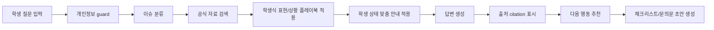
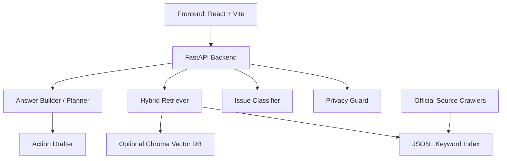

# 국민대 특화 행정서비스 에이전트 기획안

작성 기준일: 2026-05-19  
프로젝트명: KMU Campus Life Action Agent

## 1. 프로젝트 개요

본 프로젝트는 국민대학교 학생들이 학사, 행정, 생활지원 정보를 여러 공식 페이지에서 직접 찾아야 하는 불편을 줄이기 위한 국민대 특화 행정서비스 에이전트이다.

일반적인 검색형 챗봇이 아니라, 국민대학교 공식 자료를 근거로 답변하고 학생이 실제로 사용하는 표현과 상황을 이해하여 다음 행동까지 안내하는 것을 목표로 한다.

현재 구현된 서비스는 다음 기능을 포함한다.

- 국민대학교 공식 자료 기반 질의응답
- 학사/행정/학생지원/학사일정/공지 기반 검색
- 질문 이슈 분류
- 출처 citation 표시
- 학생식 표현 인식
- 신입생, 재학생, 복학생, 휴학생, 졸업예정자 상태별 맞춤 안내
- 개인정보 입력 차단
- 문의처 추천
- 문의문 초안 및 체크리스트 생성
- 프론트엔드 데모 UI
- 관리자용 수집/소스 확인 기능

## 2. 문제 정의

국민대학교 학생들이 행정 정보를 찾을 때 겪는 주요 문제는 다음과 같다.

1. 정보가 여러 위치에 분산되어 있다.
   - 학사안내
   - 학사일정
   - 학사공지
   - 행정공지
   - 장학공지
   - 학생지원 안내
   - ON국민 포털
   - eCampus
   - 생활관, 도서관, 식당, 통학버스 등 생활지원 페이지

2. 학생은 공식 명칭보다 비공식 표현을 많이 사용한다.
   - eCampus 대신 "이캠"
   - 학과사무실 대신 "과사"
   - 국가장학금 대신 "국장"
   - 수강정정 대신 "수변"
   - 종합정보시스템/ON국민 대신 "종정시", "포털"

3. 같은 질문도 학생 상태에 따라 확인해야 할 내용이 달라진다.
   - 신입생은 포털 사용자등록, eCampus 접근, 학생증 발급이 중요하다.
   - 복학생은 복학 승인, 수강신청 가능 상태, 등록금 고지서 반영을 함께 확인해야 한다.
   - 졸업예정자는 졸업요건, 증명서 발급 가능 시점, 졸업사정을 확인해야 한다.

4. 학생은 답변뿐 아니라 실제 행정 행동을 준비해야 한다.
   - 어디에 문의해야 하는지
   - 어떤 자료를 준비해야 하는지
   - 어떤 캡처를 첨부해야 하는지
   - 어떻게 메일을 보내야 하는지

## 3. 서비스 목표

본 서비스의 목표는 다음과 같다.

- 국민대 공식 자료에 근거한 신뢰도 높은 행정 안내 제공
- 학생이 실제로 사용하는 표현을 이해하는 질의응답 제공
- 학생 상태별 맞춤형 확인 항목 제공
- 단순 답변을 넘어 문의문, 체크리스트, 다음 행동까지 지원
- 개인정보와 로그인 정보를 요구하지 않는 안전한 행정 에이전트 구현

## 4. 대상 사용자

| 사용자 유형 | 주요 니즈 | 예시 질문 |
| --- | --- | --- |
| 신입생 | 포털, eCampus, 학생증, 수강신청 적응 | "이캠에 강의가 안 떠요" |
| 재학생 | 수강신청, 장학, 등록금, 생활지원 확인 | "국장 들어왔는지 어디서 봐?" |
| 복학생 | 복학 승인, 등록금, 수강신청 일정 확인 | "복학생인데 이번 주 뭐 해야 해?" |
| 휴학생 | 복학 일정, 등록금 처리, 신청 가능 절차 확인 | "휴학생도 장학 신청 가능해?" |
| 졸업예정자 | 졸업요건, 증명서, 졸업사정 확인 | "졸업요건 뭐 확인해야 해?" |

## 5. 현재 구현 기능

### 5.1 공식 근거 기반 답변

질문이 들어오면 공식 자료 검색 결과를 바탕으로 답변을 생성한다. 답변에는 `[S1]`, `[S2]`와 같은 citation이 붙고, 하단에 근거 URL과 발췌가 표시된다.

구현 파일:

- `app.py`
- `retriever/keyword_retriever.py`
- `retriever/hybrid_retriever.py`
- `agent/answer_builder.py`
- `agent/citation.py`

### 5.2 이슈 분류

현재 분류 가능한 주요 이슈는 다음과 같다.

- 출석인정
- 휴학/복학
- 수강신청/폐강
- 등록금/분납/납부확인
- 증명서
- 학생증
- 장학
- 포털/eCampus 접근
- 통학버스/주차/생활관/도서관/식단
- 학적부 정정
- 학생보험
- 병무/예비군
- 학사일정
- 졸업요건
- 문의처

구현 파일:

- `agent/classifier.py`
- `tests/test_classifier.py`

### 5.3 학생식 표현 인식

학생들이 실제로 사용하는 표현을 공식 용어와 연결한다.

| 학생 표현 | 시스템 해석 |
| --- | --- |
| 이캠, 이캠퍼스, 가대 | eCampus |
| 온국민, 종정시, 포털 | ON국민 포털 |
| 과사 | 학과사무실 |
| 국장 | 국가장학금 |
| 수변 | 수강정정 |
| 모바일 학생증, 케이카드 | 모바일학생증/K-CARD |
| 납부확인 | 등록금 납부 확인 |

구현 파일:

- `agent/student_playbook.py`
- `agent/classifier.py`
- `tests/test_student_playbook.py`

### 5.4 학생 경험 팁

답변에는 공식 근거와 별도로 `[학생 경험 팁]` 섹션이 제공된다.

예시:

- eCampus에 강의가 안 보이면 수강신청 완료 여부와 강의 공개 시점을 함께 확인한다.
- 등록금을 냈는데 납부확인이 안 보이면 은행 영수증, 납부 시간, 포털 반영 상태를 분리해서 확인한다.
- 모바일학생증이 안 찍히면 실물 카드 문제인지 모바일 인증 문제인지 먼저 구분한다.

구현 파일:

- `agent/student_playbook.py`
- `agent/answer_builder.py`

### 5.5 학생 상태별 맞춤 안내

프론트엔드에서 학생 상태를 선택하면 답변에 `[학생 맞춤 확인]` 섹션이 추가된다.

지원 상태:

- 기본
- 신입생
- 재학생
- 복학생
- 휴학생
- 졸업예정자

추가 입력:

- 대상 학기
- 관심 항목

예시:

질문: `복학생인데 이번 주 뭐 해야 해?`  
학생 상태: `복학생`  
대상 학기: `2026-2학기`  
관심 항목: `수강신청`

응답에는 다음 내용이 포함된다.

- 복학 승인 상태 확인
- 수강신청 가능 상태 확인
- 등록금 고지서 반영 여부 확인
- 복학 신청, 등록, 수강신청 일정의 순서 확인
- 2026-2학기 기준 신청기간 확인

구현 파일:

- `agent/student_context.py`
- `agent/answer_builder.py`
- `app.py`
- `frontend/src/App.jsx`
- `frontend/src/components/ChatPanel.jsx`
- `frontend/src/styles.css`
- `tests/test_student_context.py`

### 5.6 개인정보 보호

학번, 성적, 주민번호, 전화번호, 포털 ID/PW 등 민감정보를 입력하는 경우 guard가 차단한다.

허용 예시:

- "eCampus 비밀번호를 잊었어"
- "성적증명서 어디서 발급해?"

차단 예시:

- "제 비밀번호는 abcD1234입니다."
- "내 학번이랑 성적으로 처리해줘."

구현 파일:

- `agent/guard.py`
- `tests/test_guard.py`

### 5.7 다음 행동 추천 및 액션 생성

답변 이후 다음 행동을 제안한다.

지원 액션:

- 출석인정신청서 초안 작성
- 휴학 준비 체크리스트
- 복학 준비 체크리스트
- 수강신청/폐강 확인 체크리스트
- 증명서 발급 안내
- 학생증 발급 체크리스트
- 장학공지 확인 체크리스트
- 포털/eCampus 접근 체크리스트
- 생활지원 이용 체크리스트
- 학적부 정정 체크리스트
- 학생보험 청구 체크리스트
- 병무/예비군 체크리스트
- 오늘 기준 학사일정 체크리스트
- 졸업요건 간이 진단
- 수강계획 방향 추천
- 문의문 초안 작성

구현 파일:

- `agent/planner.py`
- `agent/action_state.py`
- `tools/document_drafter.py`
- `tools/checklist.py`
- `tools/contact_router.py`
- `tests/test_actions.py`

## 6. 서비스 동작 흐름

## 7. 시스템 구조

## 8. 데이터 소스

현재 수집 및 fallback 대상으로 설계된 주요 공식 소스는 다음과 같다.

- 국민대학교 학사안내
- 국민대학교 학사일정
- 학사공지
- 행정공지
- 장학공지
- 학생지원 안내
- 대학생활 안내
- 대학조직/문의처
- 요람/규정집
- SWELL 공개 게시판

Source tier:

| Tier | Source |
| --- | --- |
| 1 | 규정관리시스템 |
| 2 | 학사안내 |
| 3 | 학생지원/대학생활 안내 |
| 4 | 학사일정 |
| 5 | 공지사항 |
| 6 | 요람/규정집 |
| 7 | 대학조직/문의처 |
| 8 | SWELL 공개 게시판 |

## 9. 팀별 역할 분담

### 9.1 프론트엔드

주요 책임:

- 채팅 UI 구현
- 학생 상태 선택 UI 구현
- 대상 학기/관심 항목 입력 UI 구현
- 답변, 출처, Tool 로그, 다음 행동 표시
- 액션 입력 폼 구현
- 관리자 대시보드 구현
- 데모 시나리오 UX 구성

현재 구현:

- React + Vite 기반 UI
- 예시 질문 버튼
- 학생 상태 segmented control
- 대상 학기/관심 항목 입력
- 답변 표시 영역
- 출처 패널
- Tool 로그 패널
- ActionForm
- AdminDashboard

향후 과제:

- 긴 답변 섹션 접기/펼치기
- 공식 근거와 학생 경험 팁 시각적 구분
- 모바일 화면 가독성 개선
- 데모 모드 구성

### 9.2 백엔드

주요 책임:

- FastAPI 서버 구현
- API 설계
- 공식 자료 수집 파이프라인
- 검색 인덱스 관리
- health/source/admin API 제공
- 개인정보 guard 연동
- 액션 진행 상태 관리

현재 구현 API:

- `GET /`
- `GET /health`
- `POST /ask`
- `POST /actions/start`
- `POST /actions/continue`
- `POST /ingest/run`
- `GET /sources`

현재 구현:

- FastAPI 서버
- CORS 설정
- frontend dist 서빙
- JSONL keyword fallback
- optional Chroma vector retriever
- 공식자료 ingestion
- fallback source chunk

향후 과제:

- Chroma 설치 및 vector index 안정화
- source chunk 품질 정제
- 크롤링 실패/변경 감지 리포트 강화
- 배포 환경 설정

### 9.3 에이전트 모델 개발

주요 책임:

- 질문 이슈 분류
- 국민대 학생식 표현 사전 설계
- RAG 검색 전략 설계
- 답변 구조 설계
- citation 생성
- 학생 상태 맞춤 로직
- 다음 행동 추천
- 문의문/체크리스트 생성
- 테스트 질문 세트 설계

현재 구현:

- rule-based issue classifier
- student playbook
- student context guidance
- grounded answer builder
- contact router
- checklist generator
- action planner
- document/action drafter
- privacy guard

향후 과제:

- 이슈별 문의문 초안 고도화
- 실제 학생 인터뷰 기반 FAQ 보강
- 답변 품질 평가 기준 설계
- LLM 기반 분류/요약 모듈 확장
- source citation 정확도 평가

## 10. 현재 검증 상태

테스트 현황:

- `python -m pytest`
- 총 34개 테스트 통과

프론트 빌드:

- `npm run build`
- Vite production build 성공

실행 URL:

- Frontend: `http://127.0.0.1:5173/`
- Backend: `http://127.0.0.1:8000`

현재 health 상태:

- `status: ok`
- `keyword_chunks: 103`
- `vector_retriever_available: false`
- `vector_error: No module named 'chromadb'`

해석:

- Chroma가 설치되어 있지 않아 vector retriever는 비활성이다.
- JSONL keyword fallback으로 API와 데모 UI는 정상 동작한다.

## 11. 데모 시나리오

| 시나리오 | 학생 상태 | 질문 | 기대 포인트 |
| --- | --- | --- | --- |
| eCampus 강의 미표시 | 신입생 | 이캠에 강의가 안 떠요 | 수강신청 완료 여부, 강의 공개 시점, 개인정보 금지 |
| 등록금 납부확인 지연 | 재학생 | 등록금 냈는데 납부확인이 안 떠 | 은행 납부와 포털 반영 분리 |
| 복학생 일정 확인 | 복학생 | 복학생인데 이번 주 뭐 해야 해? | 복학 승인, 등록금, 수강신청 순서 안내 |
| 모바일학생증 오류 | 재학생 | 모바일 학생증 안 찍힘 | 실물 카드/모바일 인증 문제 구분 |
| 장학금 확인 | 재학생 | 국장 들어왔는지 어디서 봐? | 재단 신청 상태와 학교 반영 상태 구분 |
| 개인정보 guard | 기본 | 내 학번이랑 성적으로 처리해줘 | 민감정보 입력 차단 |

## 12. 차별점

본 서비스의 차별점은 다음과 같다.

1. 국민대 공식 자료에 특화되어 있다.
2. 학생이 실제로 사용하는 표현을 이해한다.
3. 학생 상태별로 확인 항목을 다르게 제시한다.
4. 단순 답변이 아니라 다음 행동을 생성한다.
5. 출처 citation을 제공한다.
6. 개인정보와 로그인 정보를 요구하지 않는다.
7. 데모 가능한 프론트엔드와 API가 이미 구현되어 있다.

## 13. 한계 및 개선 방향

현재 한계:

- Chroma vector retriever가 설치되어 있지 않아 keyword fallback 중심으로 동작한다.
- 일부 공식 페이지 원문 chunk가 길고 지저분하게 표시될 수 있다.
- 학생 경험 팁은 실제 학생 인터뷰 데이터가 아니라 사전 답사와 일반적인 행정 흐름을 바탕으로 설계된 초기 playbook이다.
- 로그인 이후 개인 화면은 접근하지 않으므로 개인별 상태 확인은 사용자가 직접 해야 한다.

개선 방향:

1. 문의문 초안 고도화
   - eCampus 강의 미표시 문의
   - 등록금 납부확인 문의
   - 장학금 반영 문의
   - 모바일학생증 오류 문의

2. 학생 인터뷰 기반 FAQ 보강
   - 실제 신입생/복학생/졸업예정자 질문 수집
   - 자주 헷갈리는 절차 정리
   - 공식 근거와 학생 경험 팁 분리 유지

3. 프론트 UX 개선
   - 답변 섹션 접기/펼치기
   - 출처/학생 팁/다음 행동 시각적 구분
   - 발표용 데모 모드

4. 검색 품질 개선
   - Chroma vector DB 설치 및 인덱싱
   - source chunk 정제
   - 최신 공지 우선순위 강화

5. 개인정보 안전성 강화
   - 이메일, 전화번호, 계좌번호, 캡처 내 민감정보 안내 강화
   - 문의문 생성 시 개인정보 placeholder 처리

## 14. 개발 일정 제안

| 단계 | 기간 | 주요 작업 |
| --- | --- | --- |
| 1단계 | 완료 | 국민대 홈페이지 사전 답사, 공식 소스 구조 파악 |
| 2단계 | 완료 | FastAPI, React UI, 검색/답변 MVP 구현 |
| 3단계 | 완료 | 학생식 표현, 학생 경험 팁, 학생 상태 맞춤 안내 구현 |
| 4단계 | 진행 예정 | 문의문 초안 고도화, 데모 시나리오 정리 |
| 5단계 | 진행 예정 | 프론트 UX 개선, source 정제, vector retriever 안정화 |
| 6단계 | 진행 예정 | 발표 자료, 사용자 테스트, 최종 품질 개선 |

## 15. 결론

현재 구현된 KMU Campus Life Action Agent는 국민대학교 공식 자료 기반 답변, 학생식 표현 이해, 학생 상태별 맞춤 안내, 개인정보 보호, 다음 행동 추천까지 포함한 동작 가능한 MVP이다.

향후에는 문의문 초안 고도화와 실제 학생 인터뷰 기반 시나리오 보강을 통해, 단순 행정 정보 검색 도구가 아니라 학생이 실제 행정 문제를 해결할 수 있도록 돕는 국민대 특화 실행형 에이전트로 발전시킬 수 있다.
