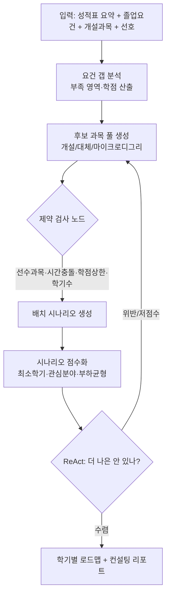
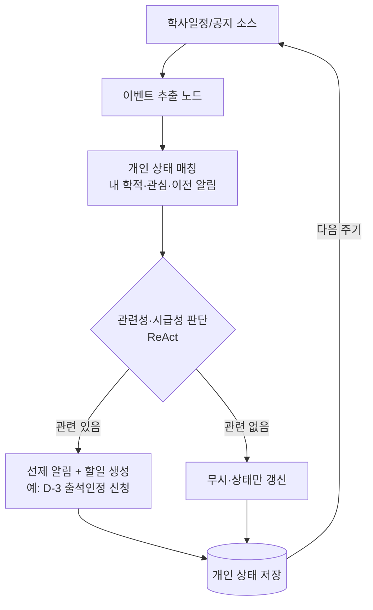
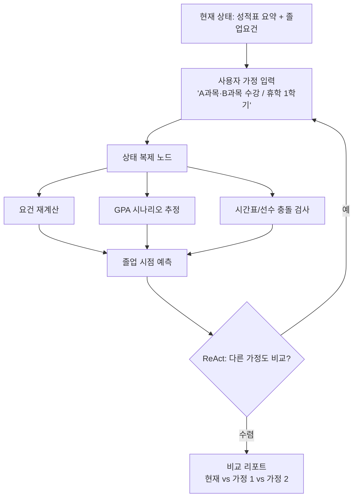
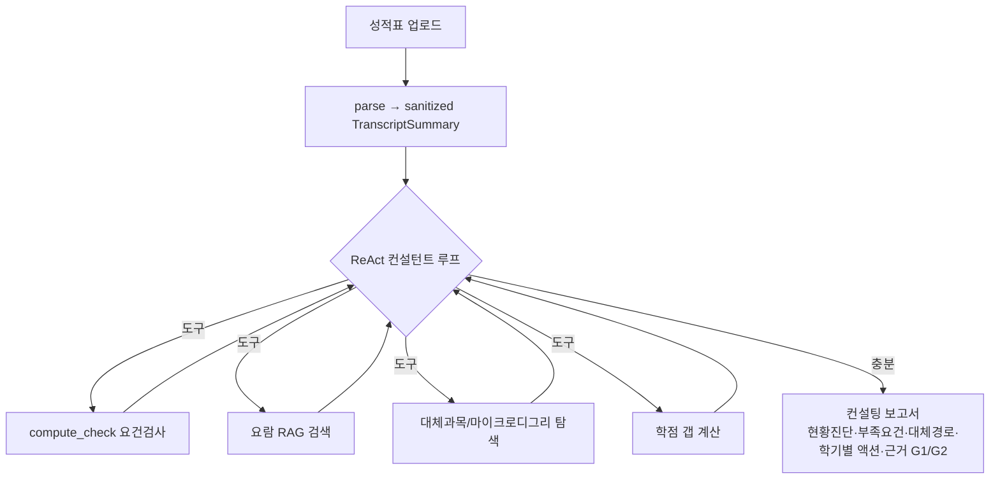

# 두 번째 주제 워크플로우 후보 (팀 논의용)

> 작성: 모델 파트 / 작성일 2026-06-02 / 발표 2026-06-09
> 목적: 교수 피드백 반영 — "곁다리 제거 → 졸업센터(RAG) 메인 + **RAG와 다른 워크플로우를 가진 두 번째 주제** 1개"를 정하기 위한 후보 비교. 팀원 공유 후 1개 선택.

---

## 0. 교수 피드백 → 설계 함의 요약

| 피드백 | 설계로 번역 |
|---|---|
| 곁다리 다 쳐내고 졸업센터 하나 메인 | 2개 축에만 집중: ① 졸업센터(RAG·심화) ② 두 번째 주제(다른 workflow) |
| 더 agentic하게, **ReAct를 풀어라** | LLM이 **Thought→Action→Observation 루프**로 *어떤 도구를 쓸지* 추론. 단 도구(Action) 자체는 결정론적 노드 유지 |
| 상용 LLM과 **차별점 / 필요성** | ChatGPT가 못 하는 3가지를 명시: ① 국민대 공식 요람·규정 grounding ② **개인 DB(성적표·학적)** ③ 결정론적 문서/보고서 산출 |
| 개인 DB 구축해 추천 | 성적표/학적을 sanitize한 개인 상태를 추천 근거로 사용 (범위는 별도 논의 — **현재 보류**) |
| 졸업센터=RAG니까 **다른 독특한 workflow** 하나 더 | 두 번째 주제는 검색·근거제시형(RAG)이 **아닌** 워크플로우 archetype이어야 함 ← 이 문서의 핵심 결정 |
| 텍스트만 뿌리지 말고 **컨설팅 보고서** | 섹션형 리포트(현황진단/부족요건/대체경로/학기별 액션플랜/근거) |

### ReAct와 우리 "노드 분절" 루브릭은 충돌하지 않는다 (중요)

```
        Thought          Action               Observation
   ┌──────────────┐   ┌──────────────┐    ┌──────────────┐
   │ LLM: 다음에   │──▶│ 결정론적 노드 │──▶ │ 구조화 결과   │──┐
   │ 어떤 도구?    │   │ (도구 호출)   │    │ (grounded)   │  │
   └──────────────┘   └──────────────┘    └──────────────┘  │
          ▲                                                   │
          └───────────────────────────────────────────────────┘
                      목표 달성까지 루프 (max N steps)
```

- **추론(routing)** = LLM (ReAct) → "agentic" 충족
- **실행(도구)** = 결정론적 노드 → 정형성·node 분절 루브릭 충족, 환각 차단
- LLM은 노드를 *대체*하지 않고 노드를 *고르고 엮는다* → CLAUDE.md 원칙과도 일치

---

## 후보 A. 플래닝 / 최적화형 — 졸업 로드맵 & 시간표 자동 설계

**한 줄:** 남은 학기를 입력하면 졸업요건·선수과목·시간충돌·학점상한을 모두 만족하는 **학기별 수강 로드맵**을 자동 설계.

**RAG와 다른 점:** 검색이 아니라 **제약 충족(constraint solving) + 최적화**. "찾아서 보여주기"가 아니라 "조합을 풀어서 만들어주기".



- **노드 분절:** 갭분석 / 후보생성 / 제약검사 / 배치 / 점수화 / 리포트 — 6개 도구
- **ReAct 루프:** LLM이 "이 시나리오 8학기 → 너무 길다, 계절학기 도구 호출" 식으로 재설계
- **개인 DB 활용:** 성적표(이수현황) + 관심분야 → 추천이 사람마다 달라짐 ← 개인화 강함
- **ChatGPT 불가 이유:** 실제 개설과목·선수체계·내 이수내역을 동시에 풀어야 함. GPT는 시간표 충돌·선수과목 검증 못 함
- **난이도:** 上 (제약 모델링·개설데이터 필요) / **데모 임팩트:** 上 (그림 한 장에 가치가 보임)
- **졸업센터와의 관계:** 졸업센터가 "진단"이면 이건 "처방·실행계획" → 자연스러운 짝

---

## 후보 B. 능동 · 상태형 학사 비서 — 이벤트 추적 + 선제 알림

**한 줄:** 묻기 전에 **먼저 챙겨주는** 에이전트. 마감/장학금/수강신청/복학 일정을 추적해 내 학적·관심과 매칭, 선제 알림과 할일을 생성.

**RAG와 다른 점:** Q&A(요청→응답)가 아니라 **event-driven + stateful 루프**. "능동성·상태 유지"가 차별 축.



- **노드 분절:** 이벤트추출 / 매칭 / 시급성판단 / 할일생성 / 상태저장
- **ReAct 루프:** "이 공지가 이 학생에게 의미 있나? → 학적 도구 조회 → 관련 → 할일 생성"
- **개인 DB 활용:** 상태 저장이 본질 → 개인 DB가 **필수**. 단 프라이버시 가드 재설계 필요
- **ChatGPT 불가 이유:** GPT는 묻지 않으면 답 안 함 + 내 일정을 추적·기억 못 함. "능동성"이 결정적 차별
- **난이도:** 中~上 (상태 영속·스케줄러·프라이버시) / **데모 임팩트:** 中 (정적 데모에선 "능동"을 보여주기 까다로움 — 타임라인 연출 필요)

---

## 후보 C. What-if 학사 시뮬레이터

**한 줄:** "이 과목 3개 들으면 졸업요건·GPA·시간표가 어떻게 되나?" 가정을 넣으면 결과를 **시뮬레이션**해 현재 vs 가정을 비교.

**RAG와 다른 점:** 검색이 아니라 **상태 복제 + 재계산(예측)**. "만약에"를 돌려보는 워크플로우.



- **노드 분절:** 가정파싱 / 상태복제 / 요건재계산 / GPA추정 / 충돌검사 / 비교리포트
- **ReAct 루프:** "가정1은 9학기 → 가정2(계절학기 추가) 자동 비교 제안"
- **개인 DB 활용:** 현재 성적표가 baseline → 가정과의 delta가 개인화
- **ChatGPT 불가 이유:** 정확한 요건 규칙 + 내 이수내역으로 계산해야 함. GPT는 추정·환각
- **난이도:** 中 (졸업센터 로직 상당 부분 재사용 가능) / **데모 임팩트:** 中~上 (인터랙티브 시연이 잘 먹힘)
- **주의:** 졸업센터와 기능이 가까워 "다른 workflow"라는 차별성이 A/B보다 약할 수 있음

---

## 비교표

| 기준 | A. 플래닝/최적화 | B. 능동·상태형 | C. What-if 시뮬 |
|---|:---:|:---:|:---:|
| RAG와의 차별성 | ◎ 가장 다름 | ◎ 가장 다름 | △ 졸업센터와 가까움 |
| ReAct 루프 자연스러움 | ◎ | ○ | ○ |
| 개인 DB 활용도 | ◎ | ◎(필수) | ○ |
| ChatGPT 대체불가 설득력 | ◎ | ◎(능동성) | ○ |
| 졸업센터와 시너지 | ◎ 진단→처방 | △ 독립적 | ◎ 진단→예측 |
| 구현 난이도 | 上 | 中~上 | 中 |
| 정적 발표 데모 임팩트 | ◎ | △(연출 필요) | ◎(인터랙티브) |
| 필요 외부데이터 | 개설과목·선수체계 | 학사일정·스케줄러 | (졸업센터 재사용) |

**모델 파트 추천:** **A (플래닝/최적화)**.
- 졸업센터(진단)와 "진단 → 처방·실행계획"으로 가장 자연스럽게 이어짐
- RAG와 워크플로우 성격이 가장 뚜렷이 다름(제약충족·최적화) → 교수님 "다른 독특한 workflow" 요구 정면 충족
- 데모에서 로드맵 그림 한 장으로 가치 전달이 쉬움
- 단, 개설과목·선수체계 데이터 확보가 관건 → 범위 축소판(필수·교양 영역 단위 학점 배치)으로 시작 가능

**대안:** 발표 임팩트의 인터랙티브함을 원하면 C, "능동 에이전트"라는 서사를 밀고 싶으면 B.

---

## 참고: 메인 축인 졸업센터는 어떻게 "agentic"해지나 (맥락 공유)

두 번째 주제와 별개로, 기존 졸업센터도 직선 파이프라인 → ReAct 루프 + 컨설팅 리포트로 강화 예정.



- 기존: parse→compute→retrieve→GPT 한 방 → **개선:** LLM이 갭을 보고 *필요한 도구만 골라 반복 호출*
- 출력: 텍스트 나열 → **섹션형 컨설팅 리포트** (citation G1/G2 유지)

---

## 다음 액션 (논의 후)

- [ ] 팀 논의로 두 번째 주제 **1개 확정** (A/B/C)
- [ ] 개인 DB 범위 결정 (현재 보류 — 세션한정 vs 프로필 영속)
- [ ] 작업 분기 전략 확정 (아래 별도 메모 참고)
